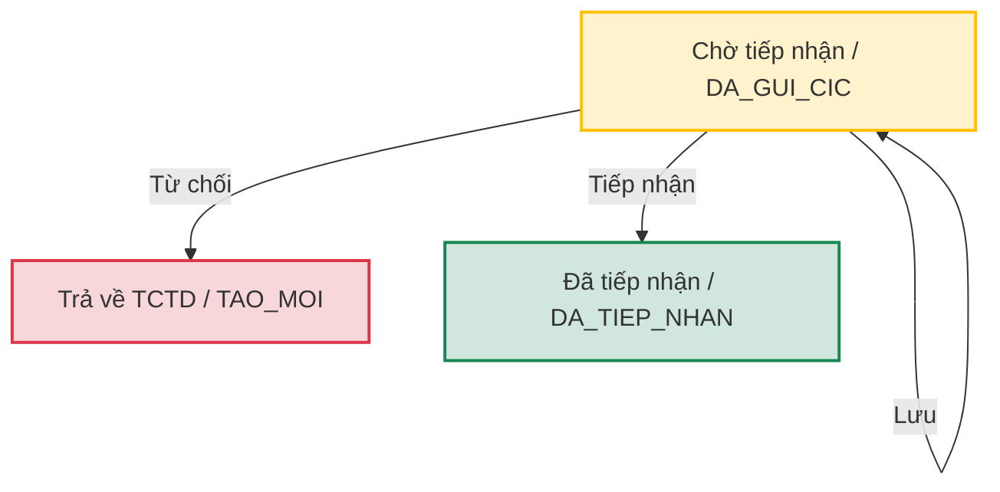

# Tài liệu Nghiệp vụ & Yêu cầu: Tiếp nhận thông tin cân đối (Core System)

Tài liệu này tổng hợp toàn bộ đặc tả nghiệp vụ, quy định giao diện và yêu cầu chức năng của phân hệ **Tiếp nhận thông tin cân đối** (`/data-collection/collect/balance`) dành cho cán bộ nghiệp vụ CIC trên hệ thống **Core System**.

---

## 1. Mục đích nghiệp vụ (Business Purpose)

Phân hệ Tiếp nhận thông tin cân đối là công cụ dành riêng cho cán bộ CIC để kiểm tra, đối soát, chỉnh sửa trực tiếp và phê duyệt số liệu báo cáo định kỳ (từ D10 đến DKQ) do các Tổ chức Tín dụng (TCTD) gửi lên qua cổng thông tin Web Portal. Phân hệ này giúp đảm bảo tính chính xác, nhất quán của dữ liệu trước khi đưa vào cơ sở dữ liệu chính thức của CIC.

---

## 2. Màn hình Danh sách tiếp nhận (`/data-collection/collect/balance`)

Cán bộ CIC sử dụng màn hình này để tìm kiếm, theo dõi và quản lý tập trung toàn bộ các tệp báo cáo đang chờ xử lý hoặc đã tiếp nhận.

### 2.1. Thanh bộ lọc (Filter Bar)
Hỗ trợ tìm kiếm nhanh các tệp báo cáo với 5 tiêu chí:
1. **Tên tệp**: Nhập chuỗi tự do (tìm kiếm theo nguyên tắc chứa chuỗi).
2. **Mã đầu mối**: Dropdown lựa chọn đơn vị gửi báo cáo (ví dụ: `31358001 - TPBank`, `01201001 - Vietcombank`, v.v.).
3. **Loại tệp**: Cho phép chọn nhiều giá trị đồng thời (Multi-select) trong danh sách 15 loại tệp báo cáo (từ D10 đến DKQ).
4. **Ngày báo cáo**: Lọc theo ngày báo cáo cụ thể (DatePicker).
5. **Trạng thái**: Dropdown lọc theo 2 trạng thái thuộc phạm vi quản lý của CIC:
   - **Chờ tiếp nhận (`DA_GUI_CIC`)**
   - **Đã tiếp nhận (`DA_TIEP_NHAN`)**

### 2.2. Bảng danh sách phân cấp (Tree Table)
*   **Cấu trúc hiển thị phân cấp**:
    *   **Dòng cha (Parent row)**: Đại diện cho tệp báo cáo tổng quát. Hiển thị: STT, Nguồn, Tên tệp (dạng link để click xem nhanh), Mã đầu mối, Loại tệp, Ngày báo cáo, Trạng thái (dưới dạng thẻ trạng thái - `StatusTag`) và Thao tác. Các cột dữ liệu chi tiết số liệu của dòng cha hiển thị giá trị mặc định là `-`.
    *   **Dòng con (Child row)**: Hiển thị các dòng nghiệp vụ chi tiết đối soát bên trong tệp (Ví dụ: CHOVAY, CAMKETNB, v.v.). Dòng con chỉ xuất hiện khi click vào biểu tượng mở rộng ở đầu dòng cha. Hiển thị thông tin chính tại cột "Nghiệp vụ" và các cột số liệu tương ứng.
*   **Cơ chế bộ lọc trong bảng**:
    *   Cột **Nghiệp vụ** tích hợp bộ lọc trực tiếp trên tiêu đề cột (Column Filter) hiển thị danh sách các nghiệp vụ duy nhất có trong bảng để người dùng lọc nhanh dòng con.
*   **Sắp xếp và tùy biến cột (Column Customization)**:
    *   **Kéo thả tiêu đề (Header Drag-and-drop)**: Cán bộ có thể kéo thả trực tiếp tiêu đề các cột (trừ các cột cố định ở hai đầu: STT, Nguồn, Tên tệp, Thao tác) để thay đổi thứ tự hiển thị ngoài bảng chính.
    *   **Cài đặt hiển thị (Column Settings Popover)**:
        - Bấm vào nút cài đặt hiển thị (icon bánh răng) để mở popover cấu hình.
        - Cho phép tìm kiếm nhanh trường thông tin qua ô nhập liệu.
        - Cho phép check/uncheck để bật/tắt hiển thị từng cột dữ liệu (trừ các cột bắt buộc luôn hiển thị như STT, Mã đầu mối, Loại tệp, Ngày báo cáo).
        - Hỗ trợ kéo thả các mục trong danh sách popover để thay đổi nhanh thứ tự cột.
        - Tích hợp 2 nút thao tác nhanh: **"Chọn tất cả"** và **"Bỏ chọn"** (chỉ giữ lại các cột bắt buộc).

### 2.3. Menu thao tác (Action Menu)
*   Nằm ở cột cuối cùng phía bên phải dòng cha.
*   Cung cấp tùy chọn **"Xem chi tiết"** (icon hình mắt) để mở popup modal phê duyệt và đối soát chi tiết.

---

## 3. Các giao diện Chi tiết & Phê duyệt

Cán bộ nghiệp vụ CIC có 2 phương thức để xem chi tiết và phê duyệt tệp báo cáo: thông qua **Popup Modal** trực tiếp tại màn hình danh sách hoặc chuyển hướng sang **Trang chi tiết độc lập**.

### 3.1. Popup Modal Chi tiết & Phê duyệt
*   **Tiêu đề Modal**: `"Chi tiết số liệu cân đối"`, đi kèm nhãn trạng thái tương ứng (`Chờ tiếp nhận` hoặc `Đã tiếp nhận`).
*   **Kích thước Modal**: Chiều rộng tự động co giãn (`getDetailTableWidth`) tùy theo loại tệp báo cáo để hiển thị tối ưu các cột dữ liệu cần thiết.
*   **Khối thông tin tệp (Metadata)**: Hiển thị gọn gàng các thông tin bao gồm Tên tệp báo cáo nguồn, Kỳ báo cáo, Đơn vị gửi dưới dạng panel nền xám nhạt (`#f8fafc`).
*   **Thông báo trạng thái (Alert)**:
    - Nếu tệp ở trạng thái **Đã tiếp nhận**, hiển thị một thông báo thành công màu xanh lá ở phía trên cùng: *"Báo cáo đã được tiếp nhận. Chức năng chỉnh sửa đã bị khóa."*
*   **Bảng chi tiết số liệu cân đối**:
    - Hiển thị danh sách các nghiệp vụ con và các trường số liệu của tệp.
    - **Trạng thái Chờ tiếp nhận**: Các ô dữ liệu số liệu hiển thị dưới dạng ô nhập liệu (`Input`) cho phép cán bộ CIC sửa trực tiếp. Khi rê chuột vào tiêu đề cột số liệu, hiển thị tooltip mô tả quy tắc kiểm tra tương ứng (ví dụ: công thức so khớp dữ liệu).
    - **Trạng thái Đã tiếp nhận**: Khóa toàn bộ các ô dữ liệu (Read-only).
*   **Nút hành động (Footer Actions)**:
    - Vị trí: Căn giữa (`justifyContent: 'center'`) với khoảng cách `gap: 12px`.
    - Định dạng: Các nút sử dụng bo góc `radius.md` và chiều rộng tối thiểu `minWidth: 100px`.
    - **Tệp Chờ tiếp nhận (`DA_GUI_CIC`)**: Hiển thị 4 nút:
      - **Đóng**: Đóng modal và không lưu các thay đổi tạm thời.
      - **Lưu**: Lưu các thay đổi số liệu tạm thời vào hệ thống nhưng giữ nguyên trạng thái `DA_GUI_CIC`.
      - **Từ chối**: Từ chối tiếp nhận dữ liệu (xem chi tiết logic ở mục 4).
      - **Tiếp nhận**: Phê duyệt và tiếp nhận chính thức dữ liệu.
    - **Tệp Đã tiếp nhận (`DA_TIEP_NHAN`)**: Chỉ hiển thị duy nhất nút **"Đóng"**.

### 3.2. Màn hình Chi tiết báo cáo độc lập (Standalone Detail Page)
*   **Đường dẫn**: `/data-collection/collect/balance/[id]` (hoặc hiển thị qua view chi tiết).
*   **Khối thông tin chung (General Information)**: Hiển thị Mã đầu mối báo cáo, Loại tệp, Ngày báo cáo, Tên tệp dưới dạng các trường chỉ đọc (Disabled).
*   **Khối chi tiết thông tin cân đối**:
    - Hiển thị bảng chi tiết số liệu tương tự như bảng trong modal.
    - Hỗ trợ chỉnh sửa số liệu trực tiếp trên dòng nghiệp vụ nếu chưa tiếp nhận.
*   **Nút hành động footer**:
    - Vị trí: Căn giữa màn hình. Các nút có chiều rộng tối thiểu `minWidth: 120px` và chiều cao `height: 40px`.
    - **Chờ tiếp nhận**: Hiển thị các nút: **"Trở về danh sách"**, **"Lưu nháp"**, **"Từ chối"**, **"Tiếp nhận"**.
    - **Đã tiếp nhận**: Chỉ hiển thị duy nhất nút **"Trở về danh sách"**.

---

## 4. Đặc tả logic nghiệp vụ & Hành vi hệ thống

### 4.1. Logic Phân quyền & Lọc dữ liệu đầu vào
*   Phân hệ Tiếp nhận thông tin cân đối của CIC chỉ hiển thị các báo cáo có trạng thái gửi lên từ TCTD:
    - **Chờ tiếp nhận (`DA_GUI_CIC`)**
    - **Đã tiếp nhận (`DA_TIEP_NHAN`)**
*   Các báo cáo ở trạng thái **Tạo mới (`TAO_MOI` - Nháp)** của TCTD sẽ hoàn toàn ẩn khỏi màn hình này của CIC.

### 4.2. Quy trình & Trạng thái phê duyệt (Approval Workflow)

*   **Hành động "Lưu" (hoặc "Lưu nháp")**:
    - Hệ thống cập nhật các thay đổi số liệu do cán bộ CIC chỉnh sửa trực tiếp trên bảng chi tiết.
    - Trạng thái tệp báo cáo vẫn giữ nguyên là **Chờ tiếp nhận (`DA_GUI_CIC`)**.
*   **Hành động "Từ chối"**:
    - Hệ thống chuyển đổi trạng thái của tệp báo cáo và toàn bộ các dòng nghiệp vụ con từ `DA_GUI_CIC` về lại **Tạo mới (`TAO_MOI`)**.
    - Tệp báo cáo này được trả về cho TCTD trên cổng Web Portal để họ chỉnh sửa, nạp lại file Excel và gửi lại sau.
    - Hệ thống tự động xóa tệp này ra khỏi danh sách đang xử lý trên giao diện của cán bộ CIC (chỉ hiển thị lại khi TCTD gửi lại).
*   **Hành động "Tiếp nhận"**:
    - Hệ thống xác nhận phê duyệt toàn bộ số liệu đối soát của tệp.
    - Trạng thái của tệp báo cáo và toàn bộ các nghiệp vụ con chuyển thành **Đã tiếp nhận (`DA_TIEP_NHAN`)**.
    - Hệ thống khóa toàn bộ các trường nhập liệu trong bảng chi tiết (chuyển sang chế độ chỉ đọc - Read-only). Không cho phép cán bộ CIC thực hiện chỉnh sửa, lưu, tiếp nhận hay từ chối lần nữa.

### 4.3. Quy tắc hiển thị cột số liệu theo loại tệp (`RAW_FILE_RULES`)
Dữ liệu đối soát thay đổi linh hoạt theo loại tệp báo cáo được chọn:
*   **Nhóm báo cáo không phân rã chi tiết** (`D10`, `D11`, `D12`, `D20`, `D40`, `D60`, `D70`): Chỉ hiển thị một dòng nghiệp vụ duy nhất tương ứng với mã loại file.
*   **Nhóm báo cáo phân rã theo nghiệp vụ con**:
    - `D31`, `D32`: Các dòng nghiệp vụ con bao gồm `CHOVAY`, `CAMKETNB`, `BAOLANH`, `TIENGUI`, `MUAXANHOI`, v.v.
    - `D33`, `D34`: Các dòng nghiệp vụ con bao gồm `THETINDUNG`.
    - `D35`: Các dòng nghiệp vụ con bao gồm `GIAINGAN`, `TRANOBG`.
    - `D36`: Các dòng nghiệp vụ con bao gồm `TRICHLAP_DP`.
    - `D50`: Các dòng nghiệp vụ con bao gồm `TRAIPHIEUDN`.
    - `DKQ`: Các dòng nghiệp vụ con bao gồm `PHANLOAINO`, `CAMKET_NGOAIBANG`.
*   **Các cột số liệu và Tooltip công thức đối soát**:
    - **Số lượng khách hàng**: Đối soát theo quy tắc số lượng định danh khách hàng vay phát sinh trong kỳ/cuối kỳ.
    - **Số lượng hợp đồng**: Đối soát theo quy tắc tổng số lượng hợp đồng tín dụng hoạt động.
    - **Mã tiền tệ**: Dropdown chọn loại tiền tệ (`VND`, `USD`, `XAU`).
    - **Dư nợ / Tổng dư nợ**: Đối soát chéo với dư nợ phân loại trong các báo cáo chi tiết.
    - **Số tiền giải ngân / Số tiền trả nợ**: Đối soát chéo với doanh số phát sinh nợ trong kỳ.
    - **Giá trị tài sản bảo đảm / Giá trị bảo đảm khoản vay**: Đối soát chéo với giá trị định giá tài sản thế chấp.
    - **Dự phòng phải trích / Dự phòng đã trích**: Đối soát chéo với tài khoản dự phòng rủi ro nội bảng.

---

## 5. Tham chiếu cấu trúc mã nguồn (Source Code Reference)

Khi phát triển hoặc bảo trì chức năng, cần lưu ý các tệp tin cấu thành sau:
*   **Màn hình chính**: [CollectBalanceListPage.tsx](file:///c:/Users/ngoct/Downloads/Code/cic-core-system/frontend/src/modules/data-collection/CollectBalance/CollectBalanceListPage.tsx)
    - Quản lý giao diện danh sách, bộ lọc, cây dữ liệu phân cấp, cài đặt hiển thị popover và popup modal phê duyệt.
*   **Trang chi tiết**: [CollectBalanceDetailPage.tsx](file:///c:/Users/ngoct/Downloads/Code/cic-core-system/frontend/src/modules/data-collection/CollectBalance/CollectBalanceDetailPage.tsx)
    - Quản lý giao diện xem/sửa chi tiết tệp độc lập.
*   **Custom Hook nghiệp vụ**: [useCollectBalance.ts](file:///c:/Users/ngoct/Downloads/Code/cic-core-system/frontend/src/modules/data-collection/CollectBalance/useCollectBalance.ts)
    - Điều phối state dữ liệu, đọc/ghi localStorage giả lập cơ sở dữ liệu và xử lý các hành động lưu nháp (`saveReportChanges`), phê duyệt tiếp nhận (`acceptReport`) và từ chối (`rejectReport`).
*   **Định nghĩa kiểu dữ liệu**: [types.ts](file:///c:/Users/ngoct/Downloads/Code/cic-core-system/frontend/src/modules/data-collection/CollectBalance/types.ts)
    - Định nghĩa các interface `BalanceReport`, `ReconciliationDetailRow` và enum trạng thái `TrangThaiTep`.
*   **Cấu hình quy tắc tệp tin**: [mockData.ts](file:///c:/Users/ngoct/Downloads/Code/cic-core-system/frontend/src/modules/web-portal/SendBalance/mockData.ts)
    - Khai báo bộ quy tắc `RAW_FILE_RULES` chứa cấu hình các trường bắt buộc và mã tooltip tương ứng cho từng loại tệp báo cáo.
