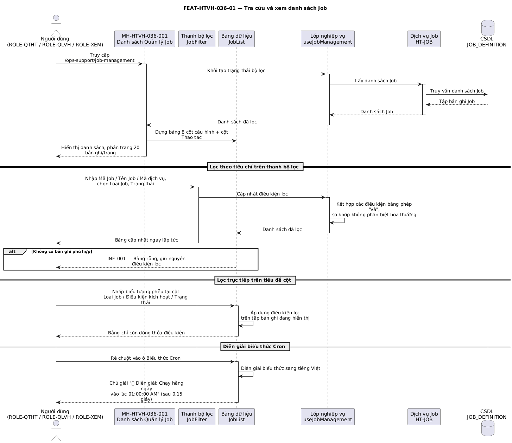

## Tính năng [FEAT-HTVH-036-01] Tra cứu và xem danh sách Job

### Mô tả yêu cầu

Người dùng tra cứu danh sách Job trong hệ thống theo Mã Job, Tên Job, Mã dịch vụ, Loại Job và Trạng thái. Hệ thống hiển thị kết quả dưới dạng bảng gồm 8 cột có thể cấu hình ẩn/hiện, kèm cột Thao tác cố định bên phải. Mỗi ô biểu thức Cron có tooltip diễn giải lịch chạy bằng tiếng Việt. Ba cột *Loại Job*, *Điều kiện kích hoạt*, *Trạng thái* hỗ trợ lọc trực tiếp bằng biểu tượng phễu trên tiêu đề cột, áp dụng chồng lên kết quả của thanh bộ lọc.

Thanh bộ lọc cho phép người dùng chủ động thêm hoặc bớt các ô tìm kiếm hiển thị. Khi một ô bị ẩn, giá trị đang nhập trong ô đó được xóa để tránh lọc ngầm.

Ràng buộc: người dùng thuộc mọi vai trò đều xem được toàn bộ danh sách Job trên hệ thống; việc phân quyền chỉ tác động tới các thao tác, không tác động tới phạm vi dữ liệu hiển thị.

### Luồng xử lý

`[[DIAGRAM: FUNC-HTVH-036_seq-01]]`



> *Hình: Trình tự — Tra cứu và xem danh sách Job.* Nguồn PlantUML: [FUNC-HTVH-036_seq-01.puml](diagrams/FUNC-HTVH-036_seq-01.puml) · bản vector: [FUNC-HTVH-036_seq-01.svg](diagrams/FUNC-HTVH-036_seq-01.svg)

**Luồng chính**

| Bước | Tác nhân | Hành động | Phản hồi của hệ thống |
|---|---|---|---|
| 1 | Người dùng | Chọn menu **Hỗ trợ vận hành > Quản trị hệ thống > Quản lý job** | Hệ thống mở MH-HTVH-036-001, đặt tiêu đề trang là "Quản lý Job", nạp danh sách Job và hiển thị bảng phân trang 20 bản ghi/trang. |
| 2 | Người dùng | Nhập từ khóa vào ô *Mã Job*, *Tên Job* hoặc *Mã dịch vụ* | Hệ thống lọc danh sách theo phép so khớp chuỗi con, không phân biệt chữ hoa chữ thường, áp dụng ngay theo từng ký tự nhập vào. |
| 3 | Người dùng | Chọn giá trị tại ô *Loại Job* hoặc *Trạng thái* | Hệ thống lọc danh sách theo phép so khớp chính xác và kết hợp với các điều kiện đang có bằng phép **và**. |
| 4 | Người dùng | Nhấp biểu tượng phễu trên tiêu đề cột *Loại Job*, *Điều kiện kích hoạt* hoặc *Trạng thái* | Hệ thống hiển thị danh sách ô chọn tương ứng và lọc trực tiếp trên tập bản ghi đang hiển thị. |
| 5 | Người dùng | Rê chuột vào ô biểu thức Cron của một dòng | Sau 0,15 giây, hệ thống hiển thị tooltip "💡 Diễn giải: {mô tả lịch chạy bằng tiếng Việt}". |
| 6 | Người dùng | Chuyển trang hoặc đổi số bản ghi mỗi trang | Hệ thống hiển thị trang tương ứng và cập nhật dòng tổng kết "Hiển thị {từ}-{đến} trong tổng {tổng} bản ghi". |

**Luồng thay thế**

| Mã luồng | Điều kiện rẽ nhánh | Xử lý | Quay về bước |
|---|---|---|---|
| ALT-01-01 | Không có bản ghi nào thỏa điều kiện lọc | Hiển thị bảng rỗng kèm thông báo không có dữ liệu, giữ nguyên các giá trị đang nhập trên thanh bộ lọc | Bước 2 |
| ALT-01-02 | Người dùng nhấp nút **Làm mới** trên thanh bộ lọc | Xóa toàn bộ giá trị của các ô lọc, danh sách trở về trạng thái ban đầu | Bước 1 |
| ALT-01-03 | Người dùng nhấp **Thêm bộ lọc** và bỏ tích một ô lọc | Ẩn ô lọc khỏi thanh bộ lọc và xóa giá trị đang nhập trong ô đó | Bước 2 |
| ALT-01-04 | Người dùng nhấp **Thêm bộ lọc** và tích lại một ô lọc đã ẩn | Hiển thị lại ô lọc với giá trị rỗng | Bước 2 |
| ALT-01-05 | Ô biểu thức Cron của Job trống | Hệ thống lấy giá trị từ cấu hình lập lịch của Job; nếu vẫn trống thì hiển thị giá trị mặc định `0 0 1 * * *` | Bước 5 |

**Luồng ngoại lệ**

| Mã luồng | Tình huống ngoại lệ | Xử lý của hệ thống | Mã thông báo |
|---|---|---|---|
| EXC-01-01 | Không kết nối được dịch vụ lấy danh sách Job | Hiển thị trạng thái lỗi kèm nút **Thử lại**, giữ nguyên thanh bộ lọc | ERR_017 |
| EXC-01-02 | Biểu thức Cron của Job sai định dạng (dưới 5 trường) | Vẫn hiển thị biểu thức nguyên văn; tooltip ghi "Biểu thức Cron không đúng định dạng" | Không áp dụng |
| EXC-01-03 | Phiên đăng nhập hết hạn khi đang thao tác | Chuyển hướng về màn hình đăng nhập, không lưu điều kiện lọc | ERR_018 |

### Thiết kế giao diện

Ảnh mockup: `FEAT-HTVH-036-01_danh-sach-job.png` (MH-HTVH-036-001)

Bố cục từ trên xuống:

```
┌─ Thanh tác vụ ─────────────────────────────────────────────────────────────┐
│ Quản lý Job          [Cài đặt hiển thị] [Xuất Excel] [+ Thiết lập job mới] │
├─ Thẻ bộ lọc ───────────────────────────────────────────────────────────────┤
│ [Mã Job…] [Tên Job…] [Mã dịch vụ…] [Loại Job ▾] [Trạng thái ▾]            │
│                              [Tìm kiếm] [Làm mới] [⚙ Thêm bộ lọc]         │
├─ Bảng dữ liệu ─────────────────────────────────────────────────────────────┤
│ ☐ │STT│ Mã Job │ Tên Job │ Mã dịch vụ │ Loại Job ▽│ ĐK kích hoạt ▽│ Cron │ │
│   │   │        │         │            │           │               │      │ │
│ Trạng thái ▽ │ Thao tác ⋮  (cố định bên phải)                            │
├────────────────────────────────────────────────────────────────────────────┤
│ Hiển thị 1-20 trong tổng {N} bản ghi        [10▾] ‹ 1 2 3 › [Đến trang __]│
└────────────────────────────────────────────────────────────────────────────┘
```

### Mô tả các thành phần trên giao diện

| STT | Tên thành phần | Kiểu dữ liệu / Loại control | Bắt buộc / Giá trị mặc định | Giới hạn | Mô tả ràng buộc |
|---|---|---|---|---|---|
| 1 | Mã Job (ô lọc) | Ô nhập chữ, có nút xóa nhanh | Không / Rỗng | Tối đa 20 ký tự | So khớp chuỗi con, không phân biệt hoa thường, trên trường Mã Job |
| 2 | Tên Job (ô lọc) | Ô nhập chữ, có nút xóa nhanh | Không / Rỗng | Tối đa 100 ký tự | So khớp chuỗi con, không phân biệt hoa thường, trên trường Tên Job |
| 3 | Mã dịch vụ (ô lọc) | Ô nhập chữ, có nút xóa nhanh | Không / Rỗng | Tối đa 50 ký tự | So khớp chuỗi con, không phân biệt hoa thường, trên trường Mã dịch vụ |
| 4 | Loại Job (ô lọc) | Danh sách chọn một, có nút xóa nhanh | Không / Rỗng | 8 tùy chọn | `DATA_SYNC`, `REPORT`, `CLEANUP`, `VALIDATION`, `BATCH`, `SPRING_BEAN`, `REST_API`, `SQL_SCRIPT` |
| 5 | Trạng thái (ô lọc) | Danh sách chọn một, có nút xóa nhanh | Không / Rỗng | 2 tùy chọn | `ACTIVE` — Hoạt động; `INACTIVE` — Ngừng hoạt động |
| 6 | Nút *Thêm bộ lọc* | Nút mở popover | Bắt buộc | 5 mục | Bật/tắt hiển thị 5 ô lọc trên thanh; bỏ tích thì xóa giá trị đang nhập của ô đó (BR-HTVH-036-014 không áp dụng) |
| 7 | Nút *Tìm kiếm* / *Làm mới* | Nút | Bắt buộc | — | *Làm mới* xóa toàn bộ điều kiện lọc về mặc định |
| 8 | Ô chọn dòng | Ô đánh dấu | Không / Bỏ chọn | 0..N dòng | Bị vô hiệu hóa khi vai trò không có quyền `run` và `delete` (BR-HTVH-036-012) |
| 9 | Cột **STT** | Số thứ tự dòng | Bắt buộc | Rộng 60px, căn giữa | Đánh số theo thứ tự dòng trong trang đang hiển thị |
| 10 | Cột **Mã Job** | Chữ dạng mã, in đậm | Bắt buộc | Rộng 150px | Hiển thị bằng phông chữ đơn cách |
| 11 | Cột **Tên Job** | Chữ in đậm | Bắt buộc | Rộng 220px | Cắt bớt bằng dấu ba chấm khi vượt quá bề rộng cột |
| 12 | Cột **Mã dịch vụ** | Chữ dạng mã | Bắt buộc | Rộng 170px | Trống thì hiển thị giá trị mặc định `SVC_CIC_CORE_SYNC` |
| 13 | Cột **Loại Job** | Chữ | Bắt buộc | Rộng 170px | Hiển thị nhãn tiếng Việt; có bộ lọc tiêu đề cột với 5 tùy chọn |
| 14 | Cột **Điều kiện kích hoạt** | Chữ | Bắt buộc | Rộng 175px | `SCHEDULER` — Bộ lập lịch; `EVENT` — Theo sự kiện; `MANUAL` — Thủ công. Trống thì hiển thị "Bộ lập lịch" |
| 15 | Cột **Biểu thức Cron** | Chữ dạng mã có nền, kèm tooltip | Bắt buộc | Rộng 140px | Tooltip diễn giải tiếng Việt, hiện sau 0,15 giây (BR-HTVH-036-014) |
| 16 | Cột **Trạng thái** | Thẻ trạng thái dùng chung | Bắt buộc | Rộng 140px | `ACTIVE` — thẻ xanh "Hoạt động"; `INACTIVE` — thẻ xám "Ngừng hoạt động". Có bộ lọc tiêu đề cột |
| 17 | Cột **Thao tác** | Menu ba chấm | Bắt buộc | Rộng 80px, cố định bên phải | Không nằm trong danh sách cấu hình cột (BR-HTVH-036-013) |
| 18 | Thanh phân trang | Bộ phân trang dùng chung | Bắt buộc / 20 bản ghi/trang | 10 / 20 / 50 / 100 | Có nút đổi số bản ghi mỗi trang, ô nhảy tới trang và dòng tổng kết |

### Xử lý sự kiện và thao tác

| STT | Sự kiện / Thao tác | Điều kiện | Xử lý của hệ thống | Kết quả / Mã thông báo |
|---|---|---|---|---|
| 1 | Mở trang | Người dùng có quyền `view` | Nạp danh sách Job, đăng ký các nút trên thanh tác vụ, dựng cột theo cấu hình hiển thị | Bảng dữ liệu hiển thị |
| 2 | Gõ ký tự vào ô lọc chữ | Ô lọc đang hiển thị | Lọc lại danh sách theo phép so khớp chuỗi con | Bảng cập nhật ngay |
| 3 | Chọn giá trị ô lọc danh sách | Ô lọc đang hiển thị | Lọc lại danh sách theo phép so khớp chính xác | Bảng cập nhật ngay |
| 4 | Nhấp **Làm mới** | Luôn khả dụng | Xóa toàn bộ giá trị lọc | Danh sách trở về trạng thái đầy đủ |
| 5 | Nhấp **Thêm bộ lọc** rồi bỏ tích một mục | Luôn khả dụng | Ẩn ô lọc và xóa giá trị của ô đó | Thanh bộ lọc thu gọn |
| 6 | Nhấp phễu trên tiêu đề cột và chọn giá trị | Cột có hỗ trợ lọc | Áp dụng điều kiện lọc trên tập bản ghi đang hiển thị | Bảng chỉ còn dòng thỏa điều kiện |
| 7 | Rê chuột vào ô biểu thức Cron | Luôn khả dụng | Diễn giải biểu thức sang tiếng Việt | Hiển thị tooltip diễn giải |
| 8 | Nhấp vào một dòng bản ghi | Luôn khả dụng | Mở popup Chi tiết Job của dòng đó | Mở MH-HTVH-036-002 |
| 9 | Đổi trang / đổi số bản ghi mỗi trang | Có nhiều hơn một trang | Hiển thị tập bản ghi tương ứng | Bảng và dòng tổng kết cập nhật |

### Thông báo

| STT | Mã thông báo | Loại | Nội dung | Điều kiện phát sinh |
|---|---|---|---|---|
| 1 | INF_001 | INF | Không có dữ liệu phù hợp với điều kiện tra cứu | Danh sách sau lọc không còn bản ghi nào |
| 2 | ERR_017 | ERR | Không thể kết nối tới hệ thống, vui lòng thử lại sau | Lỗi khi gọi dịch vụ lấy danh sách Job |
| 3 | ERR_018 | ERR | Phiên làm việc đã hết hạn, vui lòng đăng nhập lại | Phiên đăng nhập hết hiệu lực |

### Tiêu chí chấp nhận

| STT | Tiêu chí — «Khi … thì hệ thống phải …» | Mã BR liên quan |
|---|---|---|
| 1 | Khi mở trang, hệ thống phải hiển thị đủ 8 cột dữ liệu cùng cột Thao tác cố định bên phải, phân trang 20 bản ghi/trang. | BR-HTVH-036-013 |
| 2 | Khi nhập đồng thời Mã Job và Trạng thái, hệ thống phải chỉ trả về các Job thỏa **cả hai** điều kiện. | Không áp dụng |
| 3 | Khi rê chuột vào ô biểu thức Cron `0 0 1 * * *`, hệ thống phải hiển thị tooltip "Chạy hằng ngày vào lúc 01:00:00 AM". | BR-HTVH-036-014 |
| 4 | Khi rê chuột vào biểu thức Cron chỉ có 3 trường, hệ thống phải hiển thị tooltip "Biểu thức Cron không đúng định dạng". | BR-HTVH-036-014 |
| 5 | Khi bỏ tích ô lọc *Mã dịch vụ* đang có giá trị, hệ thống phải ẩn ô đó và trả danh sách về trạng thái không lọc theo Mã dịch vụ. | Không áp dụng |
| 6 | Khi lọc tiêu đề cột *Trạng thái* chọn "Hoạt động", hệ thống phải chỉ hiển thị các Job có thẻ trạng thái "Hoạt động". | Không áp dụng |

---
