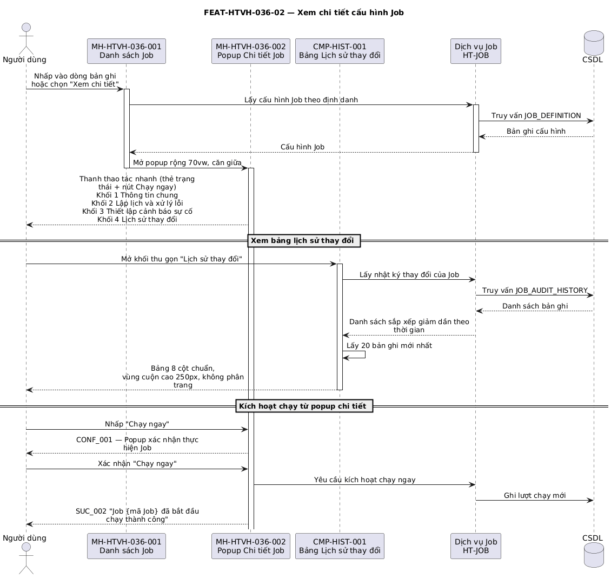

## Tính năng [FEAT-HTVH-036-02] Xem chi tiết cấu hình Job

### Mô tả yêu cầu

Hiển thị toàn bộ cấu hình của một Job dưới dạng chỉ đọc trong popup rộng `70vw`, mở ra khi người dùng nhấp vào một dòng bản ghi hoặc chọn *Xem chi tiết* trên menu thao tác. Nội dung gồm bốn khối: Thông tin chung, Lập lịch và xử lý lỗi, Thiết lập cảnh báo sự cố, và Lịch sử thay đổi.

Trên đầu popup có thanh thao tác nhanh gồm thẻ trạng thái hoạt động và nút *Chạy ngay*. Khối Lịch sử thay đổi tuân thủ quy định bảng nhật ký chuẩn 8 cột: đặt trong khối thu gọn mặc định đóng, hiển thị tối đa 20 bản ghi mới nhất, vùng cuộn cao 250px, không phân trang.

Ràng buộc: mọi trường trên popup này đều ở chế độ chỉ đọc; các ô đánh dấu của ma trận cảnh báo bị vô hiệu hóa để phản ánh đúng cấu hình mà không cho phép sửa tại chỗ.

### Luồng xử lý

`[[DIAGRAM: FUNC-HTVH-036_seq-02]]`



> *Hình: Trình tự — Xem chi tiết cấu hình Job và theo dõi tiến độ chạy.* Nguồn PlantUML: [FUNC-HTVH-036_seq-02.puml](diagrams/FUNC-HTVH-036_seq-02.puml) · bản vector: [FUNC-HTVH-036_seq-02.svg](diagrams/FUNC-HTVH-036_seq-02.svg)

**Luồng chính**

| Bước | Tác nhân | Hành động | Phản hồi của hệ thống |
|---|---|---|---|
| 1 | Người dùng | Nhấp vào một dòng bản ghi hoặc chọn **Xem chi tiết** trên menu thao tác | Hệ thống lấy cấu hình Job và mở MH-HTVH-036-002 rộng `70vw`, căn giữa, tiêu đề "Chi tiết Job: {tên Job}". |
| 2 | Hệ thống | — | Hiển thị thanh thao tác nhanh (thẻ trạng thái + nút *Chạy ngay*), tiếp theo là ba khối cấu hình chỉ đọc và khối Lịch sử thay đổi ở cuối. |
| 3 | Người dùng | Cuộn nội dung popup | Vùng nội dung cuộn độc lập, chân popup với nút *Đóng* luôn cố định. |
| 4 | Người dùng | Mở khối thu gọn **Lịch sử thay đổi** | Hệ thống hiển thị bảng 8 cột chuẩn với tối đa 20 bản ghi mới nhất xếp trên cùng, vùng cuộn cao 250px. |
| 5 | Người dùng | Rê chuột vào cột *Thời gian* hoặc *Người cập nhật* của bảng lịch sử | Hiển thị tooltip: ngày giờ đầy đủ đến giây, hoặc họ và tên đầy đủ của người cập nhật. |
| 6 | Người dùng | Nhấp **Đóng** | Đóng popup, trở về danh sách với nguyên trạng bộ lọc và trang đang xem. |

**Luồng thay thế**

| Mã luồng | Điều kiện rẽ nhánh | Xử lý | Quay về bước |
|---|---|---|---|
| ALT-03-01 | Người dùng nhấp **Chạy ngay** trên popup chi tiết | Mở popup xác nhận; sau khi xác nhận thì mở ngăn theo dõi tiến độ (FEAT-HTVH-036-06) | Bước 2 |
| ALT-03-02 | Job không có tham số bổ sung | Khối tham số hiển thị "# Không có tham số bổ sung" | Bước 2 |
| ALT-03-03 | Job không có mô tả | Ô Mô tả Job hiển thị "Không có mô tả" | Bước 2 |
| ALT-03-04 | Ô *Mô tả* trong bảng lịch sử dài quá 60 ký tự | Cắt bớt nội dung và hiển thị liên kết **Xem tiếp** để mở rộng | Bước 4 |
| ALT-03-05 | Bản ghi lịch sử có tệp đính kèm | Hiển thị tên tệp dưới dạng liên kết tải về ở cột Mô tả | Bước 4 |
| ALT-03-06 | Job chưa có bản ghi lịch sử thay đổi nào | Bảng lịch sử hiển thị trạng thái rỗng | Bước 4 |

**Luồng ngoại lệ**

| Mã luồng | Tình huống ngoại lệ | Xử lý của hệ thống | Mã thông báo |
|---|---|---|---|
| EXC-03-01 | Job đã bị xóa bởi người dùng khác trong lúc đang mở danh sách | Đóng popup và làm mới danh sách | ERR_015 |
| EXC-03-02 | Lỗi khi lấy nhật ký thay đổi | Khối Lịch sử thay đổi hiển thị trạng thái lỗi, các khối còn lại vẫn hiển thị bình thường | ERR_017 |

### Thiết kế giao diện

Ảnh mockup: `FEAT-HTVH-036-02_chi-tiet-job.png` (MH-HTVH-036-002)

```
┌─ Chi tiết Job: Đồng bộ dữ liệu khách hàng ──────────────── 70vw ── ✕ ─┐
│                            [ĐANG HOẠT ĐỘNG]  [▶ Chạy ngay]           │
├──────────────────────────────────────────────────────────────────────┤
│ ◇ THÔNG TIN CHUNG                                                    │
│   Mã Job │ Tên Job │ Loại Job │ Mã dịch vụ                           │
│   Mô tả Job                                                          │
│   Tham số bổ sung (YAML/JSON)  ← khối mã, cuộn tối đa 180px          │
├──────────────────────────────────────────────────────────────────────┤
│ ◇ LẬP LỊCH VÀ XỬ LÝ LỖI                                              │
│   ĐK kích hoạt │ SLA dự kiến (s) │ Chờ ban đầu (giây) │ Chờ tối đa (giây) │
│   Biểu thức Cron │ Số lần thử lại │ Chạy song song │ Xử lý khi bỏ lỡ │
│   Lưu log thành công (ngày) │ Lưu log lỗi (ngày)                       │
│     💡 Diễn giải: Chạy hằng ngày vào lúc 01:00:00 AM                 │
├──────────────────────────────────────────────────────────────────────┤
│ ◇ CẤU HÌNH PHỤ THUỘC                                                 │
│   ┌────────────────────┬──────────────────────┬──────────────────────┐ │
│   │ Mã Job xử lý trước │ Tên Job              │ Điều kiện kích hoạt  │ │
│   │ EXTRACT_ERP        │ Trích xuất DB ERP    │ Khi thành công       │ │
│   └────────────────────┴──────────────────────┴──────────────────────┘ │
├──────────────────────────────────────────────────────────────────────┤
│ ◇ THIẾT LẬP CẢNH BÁO SỰ CỐ                                           │
│   Email nhận cảnh báo chung: [thẻ] [thẻ]                             │
│   Bảng ma trận 5 sự kiện × (SMS │ Push │ Email │ Người nhận riêng)   │
├──────────────────────────────────────────────────────────────────────┤
│ ▸ Lịch sử thay đổi  (khối thu gọn, mặc định đóng)                    │
├──────────────────────────────────────────────────────────────────────┤
│                            [ Đóng ]                    ← căn giữa    │
└──────────────────────────────────────────────────────────────────────┘
```

### Mô tả các thành phần trên giao diện

| STT | Tên thành phần | Kiểu dữ liệu / Loại control | Bắt buộc / Giá trị mặc định | Giới hạn | Mô tả ràng buộc |
|---|---|---|---|---|---|
| 1 | Popup Chi tiết Job | Cửa sổ nổi | Bắt buộc | Rộng `70vw`, căn giữa | Vùng nội dung cuộn tối đa `80vh − 110px`; hủy nội dung khi đóng |
| 2 | Thẻ trạng thái hoạt động | Thẻ | Bắt buộc | 2 giá trị | `ACTIVE` → "ĐANG HOẠT ĐỘNG" (xanh); `INACTIVE` → "TẠM DỪNG" (xám) |
| 3 | Nút *Chạy ngay* | Nút chính, biểu tượng nút chạy | Bắt buộc | — | Kích hoạt luồng xác nhận của FEAT-HTVH-036-06 |
| 4 | **Mã Job** | Chữ dạng mã, chỉ đọc | Bắt buộc | Tối đa 20 ký tự | Phông đơn cách, in đậm |
| 5 | **Tên Job** | Chữ in đậm, chỉ đọc | Bắt buộc | Tối đa 100 ký tự | — |
| 6 | **Loại Job** | Chữ, chỉ đọc | Bắt buộc | 8 giá trị | Hiển thị dạng "Nhãn tiếng Việt (MÃ)" |
| 7 | **Mã dịch vụ** | Chữ dạng mã, chỉ đọc | Bắt buộc | Tối đa 50 ký tự | Trống thì hiển thị `SVC_CIC_CORE_SYNC` |
| 8 | **Mô tả Job** | Chữ, chỉ đọc | Không | Tối đa 1000 ký tự | Trống thì hiển thị "Không có mô tả" |
| 9 | **Tham số bổ sung** | Khối mã cuộn được, chỉ đọc | Không | Tối đa 1500 ký tự, cao tối đa 180px | Giữ nguyên xuống dòng và thụt đầu dòng của YAML/JSON |
| 10 | **Điều kiện kích hoạt** | Chữ, chỉ đọc | Bắt buộc | 3 giá trị | Bộ lập lịch (Scheduler) / Theo sự kiện (Event-driven) / Thủ công (Manual) |
| 11 | **Chờ tối đa (giây)** | Chữ, chỉ đọc | Bắt buộc / 300 | 1–86400 | — |
| 12 | **Xử lý khi bỏ lỡ lượt chạy** | Chữ, chỉ đọc | Bắt buộc / FIRE_NOW | 2 giá trị | "Chạy bù ngay khi đủ điều kiện" / "Bỏ qua lượt lỗi, chờ lịch tiếp theo" |
| 13 | **Chạy song song** | Chữ, chỉ đọc | Bắt buộc | 2 giá trị | "Khóa chạy song song" / "Cho phép chạy song song" |
| 14 | **Biểu thức Cron** | Chữ dạng mã có nền, chỉ đọc | Bắt buộc | Cú pháp Cron 5 hoặc 6 trường | Kèm dòng diễn giải tiếng Việt ngay bên dưới (BR-HTVH-036-014) |
| 15 | **Số lần thử lại tối đa** | Chữ, chỉ đọc | Bắt buộc / 3 | 0–10 | Hiển thị kèm đơn vị "lần" |
| 16 | **Chờ ban đầu (giây)** | Chữ, chỉ đọc | Bắt buộc / 60 | 1–86400 | — |
| 17 | **SLA dự kiến (giây)** | Chữ, chỉ đọc | Không | Số nguyên | — |
| 17.1 | **Lưu log thành công/lỗi (ngày)** | Chữ, chỉ đọc | Bắt buộc | Số nguyên | — |
| 17.2 | **Bảng Job phụ thuộc** | Bảng chỉ đọc | Không | Gồm 3 cột | Mã Job xử lý trước, Tên Job, Điều kiện kích hoạt |
| 18 | **Email nhận cảnh báo chung** | Danh sách thẻ, chỉ đọc | Không | Nhiều địa chỉ | Tách bằng dấu phẩy hoặc chấm phẩy, mỗi địa chỉ một thẻ |
| 19 | **Bảng ma trận cảnh báo** | Bảng, chỉ đọc | Bắt buộc | 5 dòng × 5 cột | Năm sự kiện: Khi bắt đầu chạy / Khi hoàn tất thành công / Khi gặp sự cố / Khi thử lại. Ba cột kênh dùng ô đánh dấu bị vô hiệu hóa; cột cuối liệt kê người nhận riêng dạng thẻ, trống thì ghi "Chưa cấu hình" |
| 20 | **Khối Lịch sử thay đổi** | Khối thu gọn chứa bảng | Bắt buộc / Đóng | 20 bản ghi, cuộn cao 250px | Đủ 8 cột chuẩn theo BR-HTVH-036-015, không phân trang |
| 21 | Nút *Đóng* | Nút | Bắt buộc | Rộng tối thiểu 100px | Đặt ở chân popup, căn giữa |

**Chi tiết 8 cột chuẩn của Bảng Lịch sử thay đổi**

| STT | Cột | Bề rộng | Quy tắc hiển thị |
|---|---|---|---|
| 1 | STT | 50px | Căn giữa |
| 2 | Thời gian | 170px | Hiển thị `dd/mm/yyyy`, tooltip hiện `dd/mm/yyyy hh:mm:ss` |
| 3 | Người cập nhật | 160px | Hiển thị tên đăng nhập, tooltip hiện họ và tên đầy đủ |
| 4 | Hành động | 140px | Tên thao tác đã tác động tới dữ liệu |
| 5 | Giá trị cũ | 220px | Giá trị trước khi thay đổi |
| 6 | Giá trị mới | 220px | Giá trị sau khi thay đổi thành công |
| 7 | Địa chỉ IP | 130px | Địa chỉ thiết bị thực hiện thao tác |
| 8 | Mô tả | 240px | Lý do hoặc ghi chú; dài quá 60 ký tự thì cắt bớt kèm liên kết *Xem tiếp*; tệp đính kèm hiển thị dạng liên kết tải về |

### Xử lý sự kiện và thao tác

| STT | Sự kiện / Thao tác | Điều kiện | Xử lý của hệ thống | Kết quả / Mã thông báo |
|---|---|---|---|---|
| 1 | Nhấp vào dòng bản ghi | Luôn khả dụng | Lấy cấu hình Job và mở popup chi tiết | Mở MH-HTVH-036-002 |
| 2 | Chọn *Xem chi tiết* trên menu thao tác | Luôn khả dụng | Chặn sự kiện lan lên dòng, mở popup chi tiết | Mở MH-HTVH-036-002 |
| 3 | Mở khối *Lịch sử thay đổi* | Job có bản ghi lịch sử | Lấy 20 bản ghi mới nhất và dựng bảng 8 cột | Bảng lịch sử hiển thị |
| 4 | Rê chuột vào ô *Thời gian* | — | Hiển thị tooltip ngày giờ đầy đủ đến giây | Tooltip hiển thị |
| 5 | Rê chuột vào ô *Người cập nhật* | — | Hiển thị tooltip họ và tên đầy đủ | Tooltip hiển thị |
| 6 | Nhấp *Xem tiếp* trong ô Mô tả | Nội dung dài quá 60 ký tự | Mở rộng hiển thị toàn bộ nội dung | Nội dung đầy đủ hiển thị |
| 7 | Nhấp liên kết tệp đính kèm | Bản ghi có tệp đính kèm | Tải tệp về máy người dùng | Tệp được tải về |
| 8 | Nhấp *Chạy ngay* | Có quyền `run` | Chuyển sang luồng xác nhận của FEAT-HTVH-036-06 | Mở MH-HTVH-036-006 |
| 9 | Nhấp *Đóng* | — | Đóng popup và hủy nội dung đã dựng | Trở về danh sách |

### Thông báo

| STT | Mã thông báo | Loại | Nội dung | Điều kiện phát sinh |
|---|---|---|---|---|
| 1 | ERR_015 | ERR | Job không tồn tại | Job đã bị xóa trước khi mở chi tiết |
| 2 | ERR_017 | ERR | Không thể kết nối tới hệ thống, vui lòng thử lại sau | Lỗi khi lấy dữ liệu chi tiết hoặc nhật ký thay đổi |

### Tiêu chí chấp nhận

| STT | Tiêu chí — «Khi … thì hệ thống phải …» | Mã BR liên quan |
|---|---|---|
| 1 | Khi mở popup chi tiết, hệ thống phải hiển thị đủ bốn khối theo đúng thứ tự: Thông tin chung, Lập lịch và xử lý lỗi, Thiết lập cảnh báo sự cố, Lịch sử thay đổi. | Không áp dụng |
| 2 | Khi mở popup chi tiết, khối Lịch sử thay đổi phải ở trạng thái thu gọn. | BR-HTVH-036-015 |
| 3 | Khi mở khối Lịch sử thay đổi, bảng phải hiển thị đủ 8 cột chuẩn, không phân trang, tối đa 20 bản ghi xếp mới nhất trên cùng. | BR-HTVH-036-015 |
| 4 | Khi Job có biểu thức Cron, popup phải hiển thị dòng diễn giải tiếng Việt ngay bên dưới ô biểu thức. | BR-HTVH-036-014 |
| 5 | Khi Job không có tham số bổ sung, khối tham số phải hiển thị "# Không có tham số bổ sung" thay vì để trống. | Không áp dụng |
| 6 | Mọi ô đánh dấu trên bảng ma trận cảnh báo phải ở trạng thái vô hiệu hóa, không cho phép sửa tại popup chi tiết. | Không áp dụng |

---
