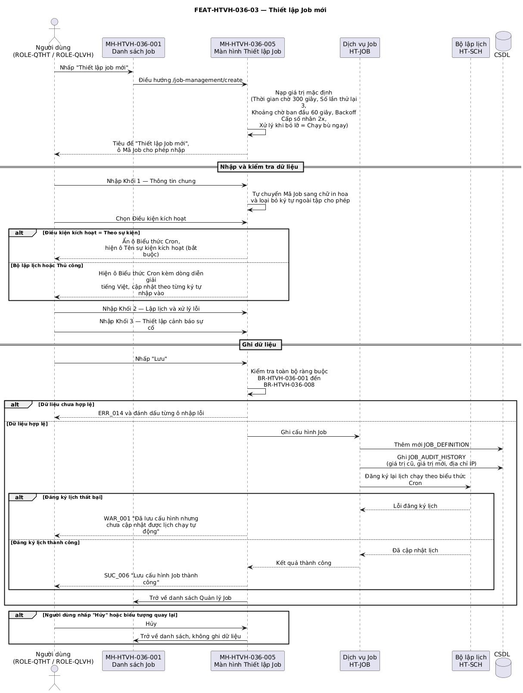

## Tính năng [FEAT-HTVH-036-03] Thiết lập Job (Tạo mới)

### Mô tả yêu cầu

Cho phép người dùng có quyền `create` hoặc `edit` khai báo Job mới trên màn hình biểu mẫu toàn trang chia thành ba khối: Thông tin chung, Lập lịch và xử lý lỗi, Thiết lập cảnh báo sự cố.

Ở chế độ cập nhật, ô Mã Job bị khóa vì đây là định danh bất biến của Job. Màn hình cũng hỗ trợ nhân bản: khi mở kèm tham số `cloneId`, hệ thống nạp toàn bộ cấu hình của Job nguồn nhưng điền sẵn Mã Job là `{mã gốc}_COPY` và Tên Job là `{tên gốc} (Bản sao)`.

Ô Điều kiện kích hoạt điều khiển ô kế bên: chọn *Theo sự kiện* thì ô Biểu thức Cron được thay bằng ô Tên sự kiện kích hoạt. Ô Biểu thức Cron luôn kèm dòng diễn giải tiếng Việt cập nhật theo từng ký tự người dùng gõ vào.

Ràng buộc: toàn bộ kiểm tra dữ liệu thực hiện trước khi ghi; nếu có ô không hợp lệ, hệ thống giữ người dùng ở lại màn hình và đánh dấu từng ô lỗi. Ghi thành công thì đồng thời sinh bản ghi nhật ký thay đổi và đăng ký lại lịch chạy với bộ lập lịch.

### Luồng xử lý

`[[DIAGRAM: FUNC-HTVH-036_seq-05]]`



> *Hình: Trình tự — Thiết lập mới và cập nhật cấu hình Job.* Nguồn PlantUML: [FUNC-HTVH-036_seq-05.puml](diagrams/FUNC-HTVH-036_seq-03.puml) · bản vector: [FUNC-HTVH-036_seq-05.svg](diagrams/FUNC-HTVH-036_seq-03.svg)

**Luồng chính**

| Bước | Tác nhân | Hành động | Phản hồi của hệ thống |
|---|---|---|---|
| 1 | Người dùng | Nhấp **Thiết lập job mới** trên thanh tác vụ, hoặc chọn **Chỉnh sửa** trên menu thao tác | Hệ thống chuyển tới MH-HTVH-036-005 tại `/create` hoặc `/{id}/edit`, đặt tiêu đề trang và đường dẫn phân cấp tương ứng, hiển thị biểu tượng quay lại trước tiêu đề. |
| 2 | Hệ thống | — | Nạp giá trị mặc định. |
| 3 | Người dùng | Nhập khối **Thông tin chung** | Ô Mã Job tự chuyển ký tự sang chữ in hoa và loại bỏ ký tự ngoài tập cho phép ngay khi gõ. Ô Mô tả và Tham số bổ sung hiển thị bộ đếm ký tự. |
| 4 | Người dùng | Chọn **Điều kiện kích hoạt** | Nếu chọn *Theo sự kiện*, hệ thống thay ô Biểu thức Cron bằng ô Tên sự kiện kích hoạt; nếu chọn *Bộ lập lịch* hoặc *Thủ công*, hệ thống hiển thị ô Biểu thức Cron kèm dòng diễn giải tiếng Việt. |
| 5 | Người dùng | Nhập khối **Lập lịch và xử lý lỗi** | Hệ thống chặn giá trị nằm ngoài khoảng cho phép ngay tại ô nhập số. |
| 6 | Người dùng | Nhập khối **Thiết lập cảnh báo sự cố** | Ô Email nhận cảnh báo chung nhận nhiều địa chỉ, tự tách khi gõ dấu chấm phẩy hoặc dấu phẩy. Bảng ma trận cho phép tích chọn kênh và chọn người nhận riêng cho từng sự kiện. |
| 7 | Người dùng | Nhấp **Lưu** | Hệ thống kiểm tra toàn bộ ràng buộc BR-HTVH-036-001 đến BR-HTVH-036-008. |
| 8 | Hệ thống | — | Dữ liệu hợp lệ: ghi cấu hình Job, sinh bản ghi nhật ký thay đổi (giá trị cũ, giá trị mới, địa chỉ IP), đăng ký lại lịch chạy, hiển thị SUC_005 hoặc SUC_006 rồi chuyển về danh sách. |

**Luồng thay thế**

| Mã luồng | Điều kiện rẽ nhánh | Xử lý | Quay về bước |
|---|---|---|---|
| ALT-05-01 | Người dùng nhấp **Hủy** hoặc biểu tượng quay lại | Trở về danh sách Quản lý Job, không ghi bất kỳ thay đổi nào | Danh sách Job |
| ALT-05-02 | Mở màn hình kèm tham số `cloneId` | Nạp cấu hình Job nguồn, điền Mã Job `{mã gốc}_COPY` và Tên Job `{tên gốc} (Bản sao)`, để ô Mã Job mở cho phép sửa | Bước 3 |
| ALT-05-03 | Điều kiện kích hoạt là *Theo sự kiện* | Ẩn ô Biểu thức Cron, hiện ô Tên sự kiện kích hoạt là bắt buộc | Bước 5 |
| ALT-05-04 | Người dùng gõ biểu thức Cron mới | Cập nhật dòng diễn giải tiếng Việt ngay dưới ô nhập theo từng ký tự | Bước 5 |
| ALT-05-05 | Người dùng gõ ký tự thường hoặc ký tự đặc biệt vào ô Mã Job | Tự chuyển sang chữ in hoa và loại bỏ ký tự ngoài tập `A–Z 0–9 - _` | Bước 3 |

**Luồng ngoại lệ**

| Mã luồng | Tình huống ngoại lệ | Xử lý của hệ thống | Mã thông báo |
|---|---|---|---|
| EXC-05-01 | Có ô bắt buộc bỏ trống hoặc giá trị sai định dạng | Giữ người dùng ở lại màn hình, đánh dấu từng ô lỗi kèm thông điệp cụ thể, không ghi dữ liệu | ERR_014 và các mã ERR_001–ERR_013 tương ứng |
| EXC-05-02 | Mở chế độ cập nhật với định danh Job không tồn tại | Hiển thị thông báo lỗi và tự chuyển về danh sách Quản lý Job | ERR_015 |
| EXC-05-03 | Mã Job nhập vào đã tồn tại trên hệ thống | Đánh dấu ô Mã Job là lỗi, không ghi dữ liệu | ERR_021 |
| EXC-05-04 | Lỗi khi ghi cấu hình xuống cơ sở dữ liệu | Giữ nguyên dữ liệu người dùng đã nhập, hiển thị thông báo lỗi | ERR_022 |
| EXC-05-05 | Ghi cấu hình thành công nhưng đăng ký lịch với bộ lập lịch thất bại | Ghi nhận cảnh báo, thông báo cho người dùng rằng cấu hình đã lưu nhưng lịch chạy chưa được cập nhật | WAR_001 |

### Thiết kế giao diện

Ảnh mockup: `FEAT-HTVH-036-05_form-job.png` (MH-HTVH-036-005)

```
← Thiết lập Job mới          Hỗ trợ vận hành > Quản lý Job > Thiết lập Job mới
┌──────────────────────────────────────────────────────────────────────────┐
│ ◇ THÔNG TIN CHUNG                                                        │
│ [Mã Job*      ] [Tên Job*      ] [Loại Job* ▾  ] [Mã dịch vụ*         ]  │
│ [Mô tả Job                                              0/1000        ]  │
│ [Tham số bổ sung (YAML/JSON)                            0/1500        ]  │
├──────────────────────────────────────────────────────────────────────────┤
│ ◇ LẬP LỊCH VÀ XỬ LÝ LỖI                                                  │
│ [ĐK kích hoạt*▾] [SLA dự kiến (s) ] [Chờ ban đầu  ] [Chờ tối đa*  ]       │
│ [Biểu thức Cron*] [Số lần thử lại] [Chạy song song ▾] [Xử lý khi bỏ lỡ ▾] │
│ [Lưu log thành công (ngày) ] [Lưu log lỗi (ngày) ]                        │
│  💡 Diễn giải: Chạy hằng ngày vào lúc 01:00:00 AM                        │
├──────────────────────────────────────────────────────────────────────────┤
│ ◇ CẤU HÌNH PHỤ THUỘC                              [+ Thêm Job phụ thuộc] │
│ ┌────────────────────┬──────────────────────┬──────────────────────┬─────┐ │
│ │ Mã Job xử lý trước │ Tên Job              │ Điều kiện kích hoạt  │ Xóa │ │
│ │ EXTRACT_ERP        │ Trích xuất DB ERP    │ [Khi thành công...▾] │ [x] │ │
│ └────────────────────┴──────────────────────┴──────────────────────┴─────┘ │
├──────────────────────────────────────────────────────────────────────────┤
│ ◇ THIẾT LẬP CẢNH BÁO SỰ CỐ                                               │
│ [Email nhận cảnh báo chung (thẻ, tách bằng ; hoặc ,)                   ]  │
│ ┌──────────────────────┬─────┬──────────┬───────┬──────────────────────┐ │
│ │ Sự kiện kích hoạt    │ SMS │Push (Web)│ Email │ Người / Email riêng  │ │
│ │ Khi bắt đầu chạy Job │ ☐   │ ☐        │ ☑     │ [chọn…]              │ │
│ │ Khi hoàn tất thành…  │ ☐   │ ☐        │ ☑     │ [chọn…]              │ │
│ │ Khi chạy chậm quá…   │ ☐   │ ☐        │ ☑     │ [chọn…]              │ │
│ │ Khi gặp sự cố / Thất…│ ☑   │ ☑        │ ☑     │ [alert_group@…]      │ │
│ │ Khi thử lại (Retry)  │ ☐   │ ☑        │ ☐     │ [chọn…]              │ │
│ └──────────────────────┴─────┴──────────┴───────┴──────────────────────┘ │
├──────────────────────────────────────────────────────────────────────────┤
│                        [ Lưu ]  [ Hủy ]              ← căn giữa          │
└──────────────────────────────────────────────────────────────────────────┘
```

### Mô tả các thành phần trên giao diện

| STT | Tên thành phần | Kiểu dữ liệu / Loại control | Bắt buộc / Giá trị mặc định | Giới hạn | Mô tả ràng buộc |
|---|---|---|---|---|---|
| 1 | Biểu tượng quay lại | Nút biểu tượng trên thanh tác vụ | Bắt buộc | Đặt trước tiêu đề trang | Trở về danh sách Quản lý Job, không ghi dữ liệu |
| 2 | **Mã Job** | Ô nhập chữ | Bắt buộc / `JOB_DATA_PROCESS` khi tạo mới | Tối đa 20 ký tự | Chỉ nhận `A–Z`, `0–9`, `-`, `_`; tự chuyển in hoa và lọc ký tự (BR-HTVH-036-001) |
| 3 | **Tên Job** | Ô nhập chữ | Bắt buộc | Tối đa 100 ký tự | Tên nghiệp vụ mô tả Job (BR-HTVH-036-003) |
| 4 | **Loại Job** | Danh sách chọn một | Bắt buộc / `DATA_SYNC` | 8 tùy chọn | `DATA_SYNC`, `REPORT`, `CLEANUP`, `VALIDATION`, `BATCH`, `SPRING_BEAN`, `REST_API`, `SQL_SCRIPT` (BR-HTVH-036-003) |
| 5 | **Mã dịch vụ** | Ô nhập chữ | Bắt buộc / `SVC_CIC_CORE_SYNC` | Tối đa 50 ký tự | Định danh dịch vụ thực thi Job, phông đơn cách (BR-HTVH-036-003) |
| 6 | **Mô tả Job** | Ô nhập nhiều dòng, 3 dòng | Không | Tối đa 1000 ký tự | Hiển thị bộ đếm ký tự (BR-HTVH-036-004) |
| 7 | **Tham số bổ sung** | Ô nhập nhiều dòng, 4 dòng, phông đơn cách | Không | Tối đa 1500 ký tự | Nội dung dạng YAML hoặc JSON, hiển thị bộ đếm ký tự (BR-HTVH-036-004) |
| 8 | **Điều kiện kích hoạt** | Danh sách chọn một | Bắt buộc / `SCHEDULER` | 3 tùy chọn | Bộ lập lịch (Scheduler) / Theo sự kiện (Event-driven) / Thủ công (Manual). Điều khiển hiển thị ô Biểu thức Cron (BR-HTVH-036-005) |
| 9 | **Chờ tối đa (giây)** | Ô nhập số | Bắt buộc / 300 | 1–86400, số nguyên | Quá thời gian này thì lượt chạy bị dừng và ghi trạng thái lỗi (BR-HTVH-036-006) |
| 10 | **Xử lý khi bỏ lỡ lượt chạy** | Danh sách chọn một | Không / `FIRE_NOW` | 2 tùy chọn | "Chạy bù ngay khi đủ điều kiện" / "Bỏ qua lượt lỗi, chờ lịch tiếp theo" |
| 11 | **Chạy song song** | Danh sách chọn một | Không / "Khóa chạy song song" | 2 tùy chọn | "Khóa chạy song song" chặn lượt chạy mới khi Job đang chạy (BR-HTVH-036-009) |
| 12 | **Biểu thức Cron** | Ô nhập chữ, phông đơn cách in đậm | Bắt buộc khi ĐK kích hoạt ≠ EVENT / `0 0 1 * * *` | Cú pháp Cron 5 hoặc 6 trường | Kèm dòng diễn giải tiếng Việt cập nhật theo từng ký tự (BR-HTVH-036-005, BR-HTVH-036-014) |
| 13 | **Tên sự kiện kích hoạt** | Ô nhập chữ, phông đơn cách | Bắt buộc khi ĐK kích hoạt = EVENT / `EVT_DATA_IMPORTED` | — | Thay thế ô Biểu thức Cron ở cùng vị trí (BR-HTVH-036-005) |
| 14 | **Số lần thử lại tối đa** | Ô nhập số | Không / 3 | 0–10, số nguyên | Đơn vị "lần" (BR-HTVH-036-007) |
| 15 | **Chờ ban đầu (giây)** | Ô nhập số | Không / 60 | 1–86400, số nguyên | Khoảng chờ trước lần thử lại đầu tiên (BR-HTVH-036-008) |
| 16 | **SLA dự kiến (giây)** | Ô nhập số | Không | Số nguyên | Thời gian dự kiến hoàn thành. Quá hạn sẽ gửi cảnh báo SLA |
| 16.1 | **Lưu log thành công (ngày)** | Ô nhập số | Không / 7 | Số nguyên 0-3650 | Số ngày lưu lại lịch sử chạy thành công. 0 là không lưu |
| 16.2 | **Lưu log lỗi (ngày)** | Ô nhập số | Không / 30 | Số nguyên 0-3650 | Số ngày lưu lại lịch sử chạy lỗi |
| 16.3 | **Nút Thêm Job phụ thuộc** | Nút | Không | — | Mở popup chọn nhiều Job cha (Parent Jobs) |
| 16.4 | **Bảng Job phụ thuộc** | Bảng | Không | Tối đa 10 dòng | Gồm Mã Job xử lý trước, Tên Job, Điều kiện kích hoạt và Xóa. Khóa ĐK Kích hoạt của Job hiện tại về Theo Sự Kiện (BR-HTVH-036-019) |
| 16.5 | **Điều kiện kích hoạt (Parent)** | Chọn một | Bắt buộc (nếu có) / Khi thành công | 3 tùy chọn | Khi thành công / Khi thất bại / Luôn luôn |
| 17 | **Email nhận cảnh báo chung** | Ô nhập nhiều thẻ | Không / `admin@cic.org.vn`, `alert@cic.org.vn` | Nhiều địa chỉ | Tự tách thẻ khi gõ dấu chấm phẩy hoặc dấu phẩy |
| 18 | **Bảng ma trận cảnh báo** | Bảng có ô nhập | Bắt buộc | 5 dòng × 5 cột | Năm sự kiện × ba kênh (SMS / Push (Web) / Email) + cột người nhận riêng |
| 19 | Ô chọn kênh trên ma trận | Ô đánh dấu | Không / theo mặc định từng sự kiện | — | Mặc định: bắt đầu và thành công bật Email; thất bại bật cả ba kênh; thử lại bật Push |
| 20 | Ô *Người dùng / Email nhận riêng* | Ô chọn nhiều, cho phép nhập tự do | Không | Nhiều giá trị | Chọn từ danh mục người dùng hệ thống hoặc gõ địa chỉ tự do; thu gọn thẻ theo bề rộng |
| 21 | Nút *Lưu* | Nút chính | Bắt buộc | Rộng tối thiểu 100px | Hiển thị trạng thái đang xử lý khi đang ghi dữ liệu |
| 22 | Nút *Hủy* | Nút | Bắt buộc | Rộng tối thiểu 100px | Trở về danh sách, không ghi dữ liệu |

### Xử lý sự kiện và thao tác

| STT | Sự kiện / Thao tác | Điều kiện | Xử lý của hệ thống | Kết quả / Mã thông báo |
|---|---|---|---|---|
| 1 | Nhấp *Thiết lập job mới* | Có quyền `create` | Chuyển tới `/create` và nạp giá trị mặc định | Mở MH-HTVH-036-005 ở chế độ tạo mới |
| 2 | Chọn *Chỉnh sửa* trên menu thao tác | Có quyền `edit` | Chuyển tới `/{id}/edit`, nạp cấu hình hiện hành, khóa ô Mã Job | Mở MH-HTVH-036-005 ở chế độ cập nhật |
| 3 | Mở màn hình kèm tham số `cloneId` | — | Nạp cấu hình Job nguồn và điền Mã Job, Tên Job theo quy tắc nhân bản | Biểu mẫu điền sẵn (BR-HTVH-036-016) |
| 4 | Gõ ký tự vào ô Mã Job | Chế độ tạo mới | Chuyển sang chữ in hoa và loại bỏ ký tự không hợp lệ | Ô hiển thị giá trị đã chuẩn hóa |
| 5 | Đổi giá trị *Điều kiện kích hoạt* | — | Chuyển đổi giữa ô Biểu thức Cron và ô Tên sự kiện kích hoạt | Biểu mẫu đổi ô nhập tương ứng |
| 6 | Gõ vào ô Biểu thức Cron | ĐK kích hoạt ≠ EVENT | Diễn giải biểu thức sang tiếng Việt | Dòng diễn giải cập nhật ngay |
| 7 | Nhấp *Lưu* — dữ liệu hợp lệ | Toàn bộ ràng buộc thỏa | Ghi cấu hình, ghi nhật ký thay đổi, đăng ký lại lịch chạy | SUC_006, chuyển về danh sách |
| 8 | Nhấp *Lưu* — dữ liệu không hợp lệ | Có ít nhất một ô sai | Đánh dấu ô lỗi, giữ nguyên dữ liệu đã nhập | ERR_014 và các mã lỗi ô tương ứng |
| 9 | Nhấp *Hủy* hoặc biểu tượng quay lại | — | Rời màn hình, không ghi dữ liệu | Trở về MH-HTVH-036-001 |

### Thông báo

| STT | Mã thông báo | Loại | Nội dung | Điều kiện phát sinh |
|---|---|---|---|---|
| 1 | ERR_001 | ERR | Vui lòng nhập mã Job | Ô Mã Job bỏ trống |
| 2 | ERR_002 | ERR | Tối đa 20 ký tự, chỉ gồm chữ in hoa, số, (-), (_) | Mã Job sai định dạng |
| 3 | ERR_003 | ERR | Vui lòng nhập tên Job | Ô Tên Job bỏ trống |
| 4 | ERR_004 | ERR | Tên Job không vượt quá 100 ký tự | Tên Job quá dài |
| 5 | ERR_005 | ERR | Vui lòng chọn loại Job | Ô Loại Job bỏ trống |
| 6 | ERR_006 | ERR | Vui lòng nhập mã dịch vụ | Ô Mã dịch vụ bỏ trống |
| 7 | ERR_007 | ERR | Mô tả không vượt quá 1000 ký tự | Mô tả quá dài |
| 8 | ERR_008 | ERR | Tham số bổ sung không vượt quá 1500 ký tự | Tham số bổ sung quá dài |
| 9 | ERR_009 | ERR | Vui lòng nhập thời gian chờ | Ô Thời gian chờ tối đa bỏ trống |
| 10 | ERR_010 | ERR | Giá trị phải nằm trong khoảng từ 1 đến 86400 giây | Thời gian chờ hoặc Khoảng chờ ban đầu ngoài khoảng |
| 11 | ERR_011 | ERR | Vui lòng nhập biểu thức Cron | Ô Biểu thức Cron bỏ trống khi ĐK kích hoạt ≠ EVENT |
| 12 | ERR_012 | ERR | Vui lòng nhập tên sự kiện | Ô Tên sự kiện bỏ trống khi ĐK kích hoạt = EVENT |
| 13 | ERR_013 | ERR | Số lần thử lại phải nằm trong khoảng từ 0 đến 10 lần | Số lần thử lại ngoài khoảng |
| 14 | ERR_014 | ERR | Vui lòng kiểm tra lại các trường thông tin chưa hợp lệ | Biểu mẫu còn ô không hợp lệ khi nhấp Lưu |
| 16 | ERR_021 | ERR | Mã Job đã tồn tại trên hệ thống | Mã Job trùng với bản ghi đã có |
| 17 | ERR_022 | ERR | Không thể lưu cấu hình Job, vui lòng thử lại sau | Lỗi khi ghi dữ liệu |
| 18 | WAR_001 | WAR | Đã lưu cấu hình nhưng chưa cập nhật được lịch chạy tự động | Đăng ký lịch với bộ lập lịch thất bại |
| 20 | SUC_006 | SUC | Lưu Job mới {mã Job} thành công | Tạo Job mới thành công |

### Tiêu chí chấp nhận

| STT | Tiêu chí — «Khi … thì hệ thống phải …» | Mã BR liên quan |
|---|---|---|
| 1 | Khi gõ chuỗi `job export 01` vào ô Mã Job, hệ thống phải hiển thị `JOBEXPORT01` — chuyển in hoa và loại bỏ ký tự không hợp lệ. | BR-HTVH-036-001 |
| 3 | Khi đổi Điều kiện kích hoạt sang *Theo sự kiện*, hệ thống phải ẩn ô Biểu thức Cron và hiện ô Tên sự kiện kích hoạt là bắt buộc. | BR-HTVH-036-005 |
| 4 | Khi nhập Số lần thử lại tối đa là 11, hệ thống phải chặn giá trị và không cho phép ghi dữ liệu. | BR-HTVH-036-007 |
| 5 | Khi nhấp Lưu với biểu mẫu còn ô bắt buộc bỏ trống, hệ thống phải giữ người dùng ở lại màn hình và đánh dấu từng ô lỗi. | BR-HTVH-036-001 đến BR-HTVH-036-008 |
| 6 | Khi lưu thành công, hệ thống phải sinh một bản ghi trong Bảng Lịch sử thay đổi ghi rõ giá trị cũ, giá trị mới và địa chỉ IP. | BR-HTVH-036-015 |
| 7 | Khi mở màn hình kèm tham số nhân bản, ô Mã Job phải hiển thị `{mã gốc}_COPY` và ô Tên Job phải hiển thị `{tên gốc} (Bản sao)`. | BR-HTVH-036-016 |

---
