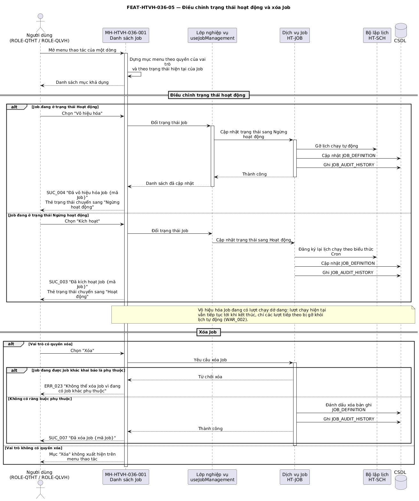

## Tính năng [FEAT-HTVH-036-05] Điều chỉnh trạng thái hoạt động và xóa Job

### Mô tả yêu cầu

Cho phép người dùng có quyền `edit` bật hoặc tắt lịch chạy tự động của một Job trực tiếp từ menu thao tác trên danh sách, và cho phép người dùng có quyền `delete` xóa Job khỏi hệ thống.

Mục menu hiển thị theo trạng thái hiện tại của Job: Job đang ở trạng thái Hoạt động thì hiện mục *Vô hiệu hóa*; Job đang ở trạng thái Ngừng hoạt động thì hiện mục *Kích hoạt*. Sau khi đổi trạng thái, thẻ trạng thái trên dòng bản ghi cập nhật ngay và hệ thống hiển thị thông báo tương ứng.

Job ở trạng thái Ngừng hoạt động vẫn có thể được kích hoạt chạy thủ công; việc vô hiệu hóa chỉ gỡ Job khỏi lịch chạy tự động.

### Luồng xử lý

`[[DIAGRAM: FUNC-HTVH-036_seq-05]]`



> *Hình: Trình tự — Điều chỉnh trạng thái hoạt động và xóa Job.* Nguồn PlantUML: [FUNC-HTVH-036_seq-05.puml](diagrams/FUNC-HTVH-036_seq-05.puml) · bản vector: [FUNC-HTVH-036_seq-05.svg](diagrams/FUNC-HTVH-036_seq-05.svg)

**Luồng chính**

| Bước | Tác nhân | Hành động | Phản hồi của hệ thống |
|---|---|---|---|
| 1 | Người dùng | Mở menu thao tác của một dòng bản ghi | Hệ thống dựng danh sách mục menu theo quyền của vai trò đang đăng nhập và theo trạng thái hiện tại của Job. |
| 2 | Người dùng | Chọn **Vô hiệu hóa** (Job đang Hoạt động) | Hệ thống đổi trạng thái Job sang `INACTIVE`, gỡ lịch chạy tự động, sinh bản ghi nhật ký thay đổi và hiển thị SUC_004. |
| 3 | Người dùng | Chọn **Kích hoạt** (Job đang Ngừng hoạt động) | Hệ thống đổi trạng thái Job sang `ACTIVE`, đăng ký lại lịch chạy theo biểu thức Cron hiện hành, sinh bản ghi nhật ký thay đổi và hiển thị SUC_003. |
| 4 | Hệ thống | — | Cập nhật thẻ trạng thái trên dòng bản ghi và cập nhật lại mục menu thao tác cho lần mở tiếp theo. |

**Luồng thay thế**

| Mã luồng | Điều kiện rẽ nhánh | Xử lý | Quay về bước |
|---|---|---|---|
| ALT-06-01 | Vai trò đăng nhập không có quyền `edit` | Không hiển thị mục *Kích hoạt* và *Vô hiệu hóa* trên menu thao tác | Bước 1 |
| ALT-06-02 | Người dùng chọn **Xóa** và có quyền `delete` | Xóa Job khỏi hệ thống, sinh bản ghi nhật ký thay đổi, hiển thị SUC_007 và làm mới danh sách | Bước 1 |
| ALT-06-03 | Vai trò đăng nhập không có quyền `delete` | Không hiển thị mục *Xóa* và đường phân cách phía trên nó | Bước 1 |
| ALT-06-04 | Đang có bộ lọc trạng thái và Job vừa đổi trạng thái không còn thỏa điều kiện | Bản ghi biến mất khỏi danh sách sau khi cập nhật | Bước 4 |

**Luồng ngoại lệ**

| Mã luồng | Tình huống ngoại lệ | Xử lý của hệ thống | Mã thông báo |
|---|---|---|---|
| EXC-06-01 | Vô hiệu hóa Job đang có lượt chạy dở dang | Lượt chạy hiện tại vẫn chạy tới khi kết thúc; Job chỉ bị gỡ khỏi lịch chạy các lượt tiếp theo | WAR_002 |
| EXC-06-02 | Xóa Job đang được Job khác khai báo là phụ thuộc | Từ chối xóa và nêu rõ danh sách Job đang phụ thuộc | ERR_023 |
| EXC-06-03 | Lỗi khi ghi trạng thái xuống cơ sở dữ liệu | Khôi phục trạng thái hiển thị về giá trị trước thao tác | ERR_022 |

### Thiết kế giao diện

Ảnh mockup: `FEAT-HTVH-036-05_menu-thao-tac.png` (MH-HTVH-036-001)

```
Menu thao tác (biểu tượng ba chấm, cột cố định bên phải)
┌──────────────────────────┐
│ 👁  Xem chi tiết          │  ← mọi vai trò
│ ✎  Chỉnh sửa             │  ← quyền edit
│ ▶  Chạy ngay             │  ← quyền run
│ ⏻  Vô hiệu hóa / Kích hoạt│  ← quyền edit, nhãn theo trạng thái
│ 🕘 Lịch sử chạy Job       │  ← mọi vai trò
│ ──────────────────────── │  ← đường phân cách, chỉ khi có quyền delete
│ 🗑  Xóa                   │  ← quyền delete, kiểu cảnh báo
└──────────────────────────┘
```

### Mô tả các thành phần trên giao diện

| STT | Tên thành phần | Kiểu dữ liệu / Loại control | Bắt buộc / Giá trị mặc định | Giới hạn | Mô tả ràng buộc |
|---|---|---|---|---|---|
| 1 | Menu thao tác | Menu thả xuống dùng chung | Bắt buộc | Tối đa 6 mục + 1 đường phân cách | Biểu tượng ba chấm, đặt ở cột cố định bên phải |
| 2 | Mục *Xem chi tiết* | Mục menu | Bắt buộc | — | Luôn hiển thị với mọi vai trò |
| 3 | Mục *Chỉnh sửa* | Mục menu | Không | — | Chỉ hiện khi có quyền `edit` |
| 4 | Mục *Chạy ngay* | Mục menu | Không | — | Chỉ hiện khi có quyền `run` |
| 5 | Mục *Vô hiệu hóa* / *Kích hoạt* | Mục menu | Không | 1 trong 2 nhãn | Chỉ hiện khi có quyền `edit`; nhãn phụ thuộc trạng thái hiện tại của Job (BR-HTVH-036-017) |
| 6 | Mục *Lịch sử chạy Job* | Mục menu | Bắt buộc | — | Luôn hiển thị với mọi vai trò |
| 7 | Mục *Xóa* | Mục menu kiểu cảnh báo | Không | — | Chỉ hiện khi có quyền `delete`, kèm đường phân cách phía trên |
| 8 | Thẻ trạng thái trên dòng | Thẻ trạng thái dùng chung | Bắt buộc | 2 giá trị | Cập nhật ngay sau khi đổi trạng thái thành công |

### Xử lý sự kiện và thao tác

| STT | Sự kiện / Thao tác | Điều kiện | Xử lý của hệ thống | Kết quả / Mã thông báo |
|---|---|---|---|---|
| 1 | Mở menu thao tác | Luôn khả dụng | Dựng mục menu theo quyền và theo trạng thái Job | Menu hiển thị đúng tập mục |
| 2 | Chọn *Vô hiệu hóa* | Job đang `ACTIVE`, có quyền `edit` | Đổi trạng thái sang `INACTIVE`, gỡ lịch chạy tự động, ghi nhật ký thay đổi | SUC_004 |
| 3 | Chọn *Kích hoạt* | Job đang `INACTIVE`, có quyền `edit` | Đổi trạng thái sang `ACTIVE`, đăng ký lại lịch chạy, ghi nhật ký thay đổi | SUC_003 |
| 4 | Chọn *Xóa* | Có quyền `delete` | Xóa Job, ghi nhật ký thay đổi, làm mới danh sách | SUC_007 |
| 5 | Chọn mục menu bất kỳ | — | Chặn sự kiện lan lên dòng để không mở popup chi tiết ngoài ý muốn | Chỉ thao tác đã chọn được thực hiện |

### Thông báo

| STT | Mã thông báo | Loại | Nội dung | Điều kiện phát sinh |
|---|---|---|---|---|
| 1 | SUC_003 | SUC | Đã kích hoạt Job {mã Job} | Đổi trạng thái sang Hoạt động thành công |
| 2 | SUC_004 | SUC | Đã vô hiệu hóa Job {mã Job} | Đổi trạng thái sang Ngừng hoạt động thành công |
| 3 | SUC_007 | SUC | Đã xóa Job {mã Job} | Xóa Job thành công |
| 4 | WAR_002 | WAR | Job đang có lượt chạy dở dang, lượt chạy hiện tại vẫn tiếp tục tới khi kết thúc | Vô hiệu hóa Job đang chạy |
| 5 | ERR_022 | ERR | Không thể cập nhật trạng thái Job, vui lòng thử lại sau | Lỗi khi ghi trạng thái |
| 6 | ERR_023 | ERR | Không thể xóa Job vì đang có Job khác phụ thuộc | Job là điều kiện tiên quyết của Job khác |

### Tiêu chí chấp nhận

| STT | Tiêu chí — «Khi … thì hệ thống phải …» | Mã BR liên quan |
|---|---|---|
| 1 | Khi Job đang ở trạng thái Hoạt động, menu thao tác phải hiển thị mục *Vô hiệu hóa* và không hiển thị mục *Kích hoạt*. | BR-HTVH-036-017 |
| 2 | Khi vô hiệu hóa thành công, thẻ trạng thái trên dòng bản ghi phải chuyển sang "Ngừng hoạt động" ngay mà không cần tải lại trang. | BR-HTVH-036-017 |
| 3 | Khi vai trò đăng nhập không có quyền `delete`, menu thao tác phải không có mục *Xóa* và không có đường phân cách phía trên nó. | BR-HTVH-036-012 |
| 4 | Khi chọn một mục trên menu thao tác, hệ thống phải không đồng thời mở popup Chi tiết Job của dòng đó. | Không áp dụng |
| 5 | Khi đổi trạng thái thành công, hệ thống phải sinh một bản ghi trong Bảng Lịch sử thay đổi. | BR-HTVH-036-015 |

---
