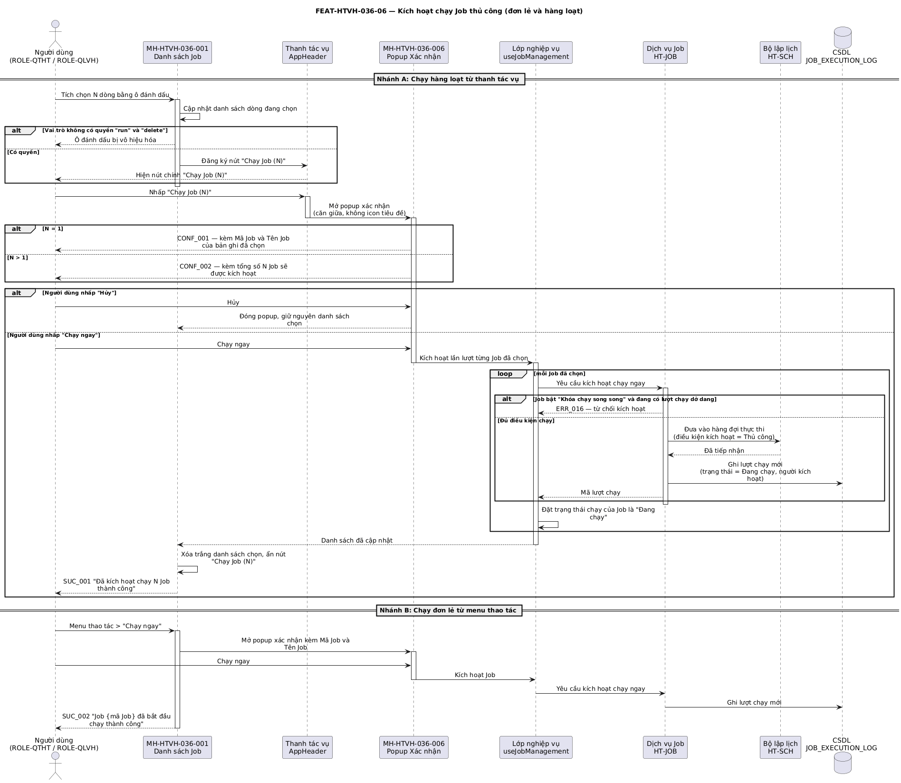

## Tính năng [FEAT-HTVH-036-06] Kích hoạt chạy Job thủ công và theo dõi tiến độ

### Mô tả yêu cầu

Cho phép người dùng có quyền `run` kích hoạt Job chạy ngay ngoài lịch định sẵn, theo hai cách: chạy đơn lẻ từ menu thao tác của một dòng, hoặc chạy hàng loạt bằng cách tích chọn nhiều dòng rồi nhấp nút *Chạy Job (N)* trên thanh tác vụ. Nút này chỉ xuất hiện khi có ít nhất một dòng được chọn.

Cả hai cách đều bắt buộc đi qua popup xác nhận. Khi chọn đúng một Job, popup hiển thị Mã Job và Tên Job của bản ghi đó để người dùng đối chiếu; khi chọn nhiều Job, popup hiển thị tổng số Job sẽ được kích hoạt.

Sau khi kích hoạt từ màn hình hoặc popup Chi tiết Job, hệ thống đưa Job vào hàng đợi thực thi và hiển thị thông báo "Job {mã Job} đã bắt đầu chạy thành công". Trang/popup Chi tiết Job giữ nguyên, không đóng.

Trường hợp ngoại lệ: Job có bật "Khóa chạy song song" và đang có lượt chạy dở dang thì không được kích hoạt thêm lượt mới.

### Luồng xử lý

`[[DIAGRAM: FUNC-HTVH-036_seq-06]]`



> *Hình: Trình tự — Kích hoạt chạy Job thủ công (đơn lẻ và hàng loạt).* Nguồn PlantUML: [FUNC-HTVH-036_seq-06.puml](diagrams/FUNC-HTVH-036_seq-06.puml) · bản vector: [FUNC-HTVH-036_seq-06.svg](diagrams/FUNC-HTVH-036_seq-06.svg)

**Luồng chính — chạy hàng loạt**

| Bước | Tác nhân | Hành động | Phản hồi của hệ thống |
|---|---|---|---|
| 1 | Người dùng | Tích chọn N dòng bằng ô đánh dấu trên bảng | Hệ thống ghi nhận danh sách chọn và hiển thị nút **Chạy Job (N)** ở vị trí nút chính trên thanh tác vụ; nút *Thiết lập job mới* lùi về kiểu nút thường (xem BR-HTVH-036-019). |
| 2 | Người dùng | Nhấp **Chạy Job (N)** | Hệ thống mở MH-HTVH-036-006 căn giữa màn hình, tiêu đề "Xác nhận thực hiện Job", không có icon tiêu đề. |
| 3 | Hệ thống | — | Nếu N = 1, hiển thị thêm khối thông tin Mã Job và Tên Job của bản ghi đã chọn; nếu N > 1, hiển thị câu hỏi kèm tổng số Job. |
| 4 | Người dùng | Nhập tham số bổ sung (tùy chọn) và nhấp **Chạy ngay** | Hệ thống lần lượt đưa từng Job vào hàng đợi thực thi, sinh bản ghi lượt chạy mới với điều kiện kích hoạt là *Thủ công* và người kích hoạt là tài khoản đang đăng nhập. |
| 5 | Hệ thống | — | Đặt trạng thái chạy của các Job là `RUNNING`, xóa trắng danh sách chọn, ẩn nút *Chạy Job (N)* và hiển thị SUC_001. |

**Luồng chính — chạy đơn lẻ**

| Bước | Tác nhân | Hành động | Phản hồi của hệ thống |
|---|---|---|---|
| 1 | Người dùng | Mở menu thao tác của một dòng và chọn **Chạy ngay** | Hệ thống mở popup xác nhận kèm Mã Job và Tên Job của dòng đó. |
| 2 | Người dùng | Nhập tham số bổ sung (tùy chọn) và nhấp **Chạy ngay** | Hệ thống đưa Job vào hàng đợi thực thi, sinh bản ghi lượt chạy mới và hiển thị SUC_002. |


**Luồng thay thế**

| Mã luồng | Điều kiện rẽ nhánh | Xử lý | Quay về bước |
|---|---|---|---|
| ALT-02-01 | Người dùng nhấp **Hủy** trên popup xác nhận | Đóng popup, không kích hoạt Job nào, **giữ nguyên** danh sách dòng đang chọn | Bước 1 (chạy hàng loạt) |
| ALT-02-02 | Người dùng bỏ chọn hết các dòng | Ẩn nút *Chạy Job (N)* khỏi thanh tác vụ | Bước 1 |
| ALT-02-03 | Người dùng nhấp **Dừng** trên ngăn theo dõi tiến độ | Hệ thống yêu cầu dừng lượt chạy, đặt lượt chạy về trạng thái `CANCELLED` và hiển thị SUC_008 | Bước 4 (theo dõi tiến độ) |
| ALT-02-04 | Người dùng nhấp **Tải** trên ngăn theo dõi tiến độ | Kết xuất toàn bộ dòng nhật ký đang hiển thị thành tệp `{mã Job}-progress.log` và tải về máy | Bước 3 |
| ALT-02-05 | Người dùng nhấp **Sao** trên ngăn theo dõi tiến độ | Sao chép toàn bộ nhật ký vào bộ nhớ tạm của hệ điều hành | Bước 3 |
| ALT-02-06 | Người dùng đóng ngăn theo dõi tiến độ khi lượt chạy chưa xong | Đóng ngăn, lượt chạy vẫn tiếp tục ở phía máy chủ | Danh sách Job |

**Luồng ngoại lệ**

| Mã luồng | Tình huống ngoại lệ | Xử lý của hệ thống | Mã thông báo |
|---|---|---|---|
| EXC-02-01 | Job bật "Khóa chạy song song" và đang có lượt chạy ở trạng thái `RUNNING` | Từ chối kích hoạt Job đó, các Job còn lại trong lô vẫn được kích hoạt bình thường | ERR_016 |
| EXC-02-02 | Vai trò đăng nhập không có quyền `run` | Không hiển thị mục *Chạy ngay* trên menu thao tác; ô chọn dòng bị vô hiệu hóa nếu cũng không có quyền `delete` | Không áp dụng |
| EXC-02-03 | Lỗi khi gửi yêu cầu kích hoạt tới dịch vụ Job | Hiển thị thông báo lỗi, không sinh bản ghi lượt chạy, giữ nguyên trạng thái Job | ERR_019 |
| EXC-02-04 | Lượt chạy vượt quá Thời gian chờ tối đa | Dừng lượt chạy, ghi trạng thái `FAILED`, kích hoạt chính sách thử lại nếu còn lượt thử | ERR_020 |
| EXC-02-05 | Lượt chạy kết thúc với trạng thái `FAILED` | Gửi cảnh báo theo dòng *Khi gặp sự cố / Thất bại* của ma trận thông báo đã cấu hình | Không áp dụng |

### Thiết kế giao diện

Ảnh mockup: `FEAT-HTVH-036-06_xac-nhan-chay-job.png` (MH-HTVH-036-006), `FEAT-HTVH-036-06_tien-do-chay-job.png` (MH-HTVH-036-003)

```
MH-HTVH-036-006 — Popup xác nhận (căn giữa, không icon tiêu đề)
┌────────────────────────────────────────────────┐
│ Xác nhận thực hiện Job                      ✕ │
├────────────────────────────────────────────────┤
│ Bạn có chắc chắn muốn kích hoạt chạy Job đã   │
│ chọn ngay bây giờ không?                       │
│ ┌────────────────────────────────────────────┐ │
│ │ Mã Job:  SYNC_CUSTOMER_DB                  │ │
│ │ Tên Job: Đồng bộ dữ liệu khách hàng        │ │
│ └────────────────────────────────────────────┘ │
│ Tham số chạy bổ sung (JSON/YAML) (Tùy chọn):   │
│ [ { "run_date": "2023-10-01" }               ] │
│              [  Hủy  ] [ Chạy ngay ]           │  ← căn giữa
└────────────────────────────────────────────────┘
```

### Mô tả các thành phần trên giao diện

| STT | Tên thành phần | Kiểu dữ liệu / Loại control | Bắt buộc / Giá trị mặc định | Giới hạn | Mô tả ràng buộc |
|---|---|---|---|---|---|
| 1 | Ô chọn dòng | Ô đánh dấu | Không / Bỏ chọn | 0..N dòng | Vô hiệu hóa khi vai trò thiếu cả hai quyền `run` và `delete` (BR-HTVH-036-012) |
| 2 | Nút *Chạy Job (N)* | Nút, biểu tượng nút chạy | Xuất hiện tự động | Nhãn kèm số lượng đang chọn | Chỉ hiện khi N ≥ 1. Khi hiện thì chiếm vị trí nút chính của thanh tác vụ (BR-HTVH-036-011, BR-HTVH-036-019) |
| 3 | Mục menu *Chạy ngay* | Mục menu thao tác | Không | — | Chỉ hiện khi vai trò có quyền `run` |
| 4 | Popup xác nhận | Cửa sổ xác nhận | Bắt buộc | Căn giữa màn hình | Không có icon tiêu đề; hai nút căn giữa ở chân, mỗi nút rộng tối thiểu 90px (BR-HTVH-036-010) |
| 5 | Khối thông tin Job trên popup | Khối chữ nền nhạt | Chỉ khi chọn đúng 1 Job | 2 dòng | Dòng 1 Mã Job (phông đơn cách, in đậm), dòng 2 Tên Job (in đậm) |
| 5.1 | **Tham số chạy bổ sung** | Ô nhập nhiều dòng | Không | Tối đa 1500 ký tự | Định dạng JSON/YAML, dùng để ghi đè tham số của lượt chạy này |
| 6 | Nút *Chạy ngay* / *Hủy* | Nút | Bắt buộc | Rộng tối thiểu 90px | *Chạy ngay* là nút chính, đặt bên phải |
| 7 | Ngăn theo dõi tiến độ | Ngăn trượt bên phải | Bắt buộc | Rộng 700px | Tiêu đề "Tiến độ: {tên Job}" |
| 8 | Dải thông báo trạng thái | Dải thông báo | Bắt buộc | 2 trạng thái | Đang chạy (thông tin) / Đã hoàn thành (thành công) |
| 9 | Thanh tiến độ | Thanh tiến độ | Bắt buộc / 0% | 0–100% | Trạng thái hoạt hình khi đang chạy, chuyển sang thành công khi đạt 100% |
| 10 | Chỉ số *Thời gian (giây)* | Số | Bắt buộc / 0 | Số nguyên không âm | Đếm từ lúc bắt đầu lượt chạy |
| 11 | Chỉ số *Bản ghi xử lý* | Số | Bắt buộc / 0 | Số nguyên không âm | Lũy kế số bản ghi đã xử lý |
| 12 | Thẻ *Bước hiện tại* | Thẻ | Bắt buộc | 1 giá trị | Tên bước đang thực hiện của lượt chạy. **Mã nguồn hiện chưa cập nhật giá trị này** — thẻ luôn giữ nguyên chuỗi khởi tạo, xem Vấn đề còn mở dòng 14 |
| 13 | Khung nhật ký thời gian thực | Vùng cuộn nền tối | Bắt buộc | Cao 300px | Mỗi dòng gồm dấu thời gian, mức nhật ký và nội dung; tô màu theo mức `ERROR` / `WARN` / `INFO` / `DEBUG`; tự cuộn xuống dòng cuối |
| 14 | Nút *Dừng* / *Tải* / *Sao* | Nút nhỏ trên đầu ngăn | *Dừng* chỉ hiện khi đang chạy | — | *Dừng* mang kiểu cảnh báo; *Tải* kết xuất tệp `.log`; *Sao* chép nhật ký vào bộ nhớ tạm |

### Xử lý sự kiện và thao tác

| STT | Sự kiện / Thao tác | Điều kiện | Xử lý của hệ thống | Kết quả / Mã thông báo |
|---|---|---|---|---|
| 1 | Tích chọn ô đánh dấu | Vai trò có quyền `run` hoặc `delete` | Cập nhật danh sách dòng đang chọn | Hiện nút *Chạy Job (N)* trên thanh tác vụ |
| 2 | Bỏ chọn toàn bộ | Đang có dòng được chọn | Xóa danh sách chọn | Ẩn nút *Chạy Job (N)* |
| 3 | Nhấp *Chạy Job (N)* | N ≥ 1 | Mở popup xác nhận | Hiển thị MH-HTVH-036-006 |
| 4 | Nhấp *Chạy ngay* trên popup | Đã xác nhận | Kích hoạt lần lượt từng Job, sinh bản ghi lượt chạy, xóa danh sách chọn | SUC_001 |
| 5 | Nhấp *Hủy* trên popup | — | Đóng popup, giữ nguyên danh sách chọn | Không có thông báo |
| 6 | Chọn *Chạy ngay* trên menu thao tác | Có quyền `run` | Mở popup xác nhận cho một Job | SUC_002 sau khi xác nhận |
| 7 | Nhấp *Chạy ngay* trên popup Chi tiết Job | Có quyền `run` | Mở popup xác nhận rồi mở ngăn theo dõi tiến độ | SUC_002, INF_002 |
| 8 | Nhấp *Dừng* trên ngăn tiến độ | Lượt chạy đang ở `RUNNING` | Yêu cầu dừng lượt chạy, đặt trạng thái `CANCELLED` | SUC_008 |
| 9 | Nhấp *Tải* trên ngăn tiến độ | Có ít nhất một dòng nhật ký | Kết xuất nhật ký thành tệp văn bản | Tệp `{mã Job}-progress.log` |
| 10 | Nhấp *Sao* trên ngăn tiến độ | Có ít nhất một dòng nhật ký | Sao chép nhật ký vào bộ nhớ tạm | Nhật ký đã nằm trong bộ nhớ tạm |
| 11 | Lượt chạy đạt 100% | — | Kết thúc lượt chạy, ghi trạng thái `SUCCESS` | INF_003 |

### Thông báo

| STT | Mã thông báo | Loại | Nội dung | Điều kiện phát sinh |
|---|---|---|---|---|
| 1 | CONF_001 | CONF | Bạn có chắc chắn muốn kích hoạt chạy Job này ngay bây giờ không? | Kích hoạt một Job đơn lẻ |
| 2 | CONF_002 | CONF | Bạn có chắc chắn muốn kích hoạt chạy {N} Job đã chọn ngay bây giờ không? | Kích hoạt nhiều Job cùng lúc |
| 3 | SUC_001 | SUC | Đã kích hoạt chạy {N} Job thành công | Xác nhận chạy hàng loạt thành công |
| 4 | SUC_002 | SUC | Job {mã Job} đã bắt đầu chạy thành công | Xác nhận chạy đơn lẻ thành công |
| 5 | SUC_008 | SUC | Đã dừng Job thành công | Dừng lượt chạy đang thực thi |
| 6 | INF_002 | INF | Job đang chạy — theo dõi tiến độ và nhật ký bên dưới | Mở ngăn theo dõi tiến độ |
| 7 | INF_003 | INF | Job đã hoàn thành trong {n} giây với {m} bản ghi xử lý | Lượt chạy kết thúc thành công |
| 8 | ERR_016 | ERR | Job đang có lượt chạy dở dang, không thể kích hoạt song song | Job bật khóa chạy song song và đang chạy |
| 9 | ERR_019 | ERR | Không thể kích hoạt Job, vui lòng thử lại sau | Lỗi khi gửi yêu cầu tới dịch vụ Job |
| 10 | ERR_020 | ERR | Lượt chạy đã vượt quá thời gian chờ tối đa và bị dừng | Lượt chạy quá thời gian cho phép |

### Tiêu chí chấp nhận

| STT | Tiêu chí — «Khi … thì hệ thống phải …» | Mã BR liên quan |
|---|---|---|
| 1 | Khi tích chọn ít nhất một dòng, hệ thống phải hiển thị nút *Chạy Job (N)* trên thanh tác vụ với N đúng bằng số dòng đang chọn. | BR-HTVH-036-011 |
| 2 | Khi bỏ chọn hết các dòng, hệ thống phải ẩn nút *Chạy Job (N)* khỏi thanh tác vụ. | BR-HTVH-036-011 |
| 3 | Khi nhấp *Chạy Job (1)*, popup xác nhận phải hiển thị đúng Mã Job và Tên Job của bản ghi đang chọn. | BR-HTVH-036-010 |
| 4 | Khi nhấp *Hủy* trên popup xác nhận, hệ thống phải giữ nguyên các dòng đang chọn và không kích hoạt Job nào. | BR-HTVH-036-010 |
| 5 | Khi xác nhận chạy thành công, hệ thống phải xóa trắng danh sách chọn và hiển thị thông báo kèm đúng số lượng Job đã kích hoạt. | BR-HTVH-036-011 |
| 6 | Khi vai trò đăng nhập không có quyền `run` và không có quyền `delete`, ô chọn dòng phải ở trạng thái vô hiệu hóa. | BR-HTVH-036-012 |
| 7 | Khi kích hoạt Job đang có lượt chạy dở dang và Job bật khóa chạy song song, hệ thống phải từ chối và hiển thị ERR_016. | BR-HTVH-036-009 |

---
