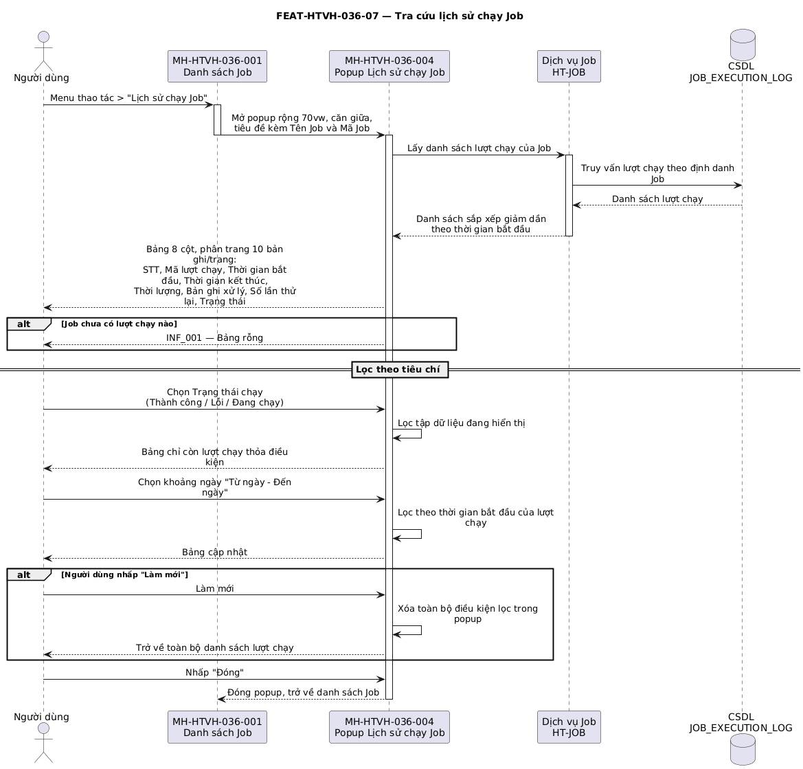

## Tính năng [FEAT-HTVH-036-07] Tra cứu lịch sử chạy Job

### Mô tả yêu cầu

Cho phép người dùng tra cứu các lượt thực thi đã diễn ra của một Job qua popup rộng `70vw`, mở từ mục *Lịch sử chạy Job* trên menu thao tác. Bảng kết quả gồm 9 cột, phân trang 10 bản ghi mỗi trang, có thanh lọc theo trạng thái lượt chạy và khoảng thời gian.

Cột *Bản ghi xử lý* hiển thị đồng thời số bản ghi thành công (dấu ✓, màu xanh) và số bản ghi lỗi (dấu ✗, màu đỏ, chỉ hiện khi lớn hơn 0). Cột *Số lần thử lại* hiển thị dạng số nguyên thuần túy, căn giữa, không dùng thẻ màu. Cột *Thời lượng* quy đổi từ mili giây sang định dạng `{phút}m {giây}s` khi vượt quá 60 giây, ngược lại hiển thị `{giây}s`; lượt chạy chưa kết thúc hiển thị dấu gạch ngang.

### Luồng xử lý

`[[DIAGRAM: FUNC-HTVH-036_seq-07]]`



> *Hình: Trình tự — Tra cứu lịch sử chạy Job.* Nguồn PlantUML: [FUNC-HTVH-036_seq-07.puml](diagrams/FUNC-HTVH-036_seq-07.puml) · bản vector: [FUNC-HTVH-036_seq-07.svg](diagrams/FUNC-HTVH-036_seq-07.svg)

**Luồng chính**

| Bước | Tác nhân | Hành động | Phản hồi của hệ thống |
|---|---|---|---|
| 1 | Người dùng | Mở menu thao tác của một dòng và chọn **Lịch sử chạy Job** | Hệ thống mở MH-HTVH-036-004 rộng `70vw`, căn giữa, tiêu đề "Lịch sử chạy Job: {tên Job} ({mã Job})". |
| 2 | Hệ thống | — | Lấy danh sách lượt chạy của Job, sắp xếp giảm dần theo thời gian bắt đầu và hiển thị bảng 9 cột phân trang 10 bản ghi/trang. |
| 3 | Người dùng | Chọn giá trị tại ô lọc **Trạng thái chạy** | Hệ thống lọc lại danh sách lượt chạy theo trạng thái đã chọn. |
| 4 | Người dùng | Chọn khoảng ngày tại ô **Từ ngày – Đến ngày** | Hệ thống lọc các lượt chạy có thời gian bắt đầu nằm trong khoảng đã chọn. |
| 5 | Người dùng | Chuyển trang | Hệ thống hiển thị tập lượt chạy của trang tương ứng. |
| 6 | Người dùng | Nhấp **Đóng** | Đóng popup, trở về danh sách Job. |

**Luồng thay thế**

| Mã luồng | Điều kiện rẽ nhánh | Xử lý | Quay về bước |
|---|---|---|---|
| ALT-04-01 | Người dùng nhấp **Làm mới** trên thanh lọc | Xóa điều kiện lọc trạng thái và khoảng thời gian, trở về toàn bộ danh sách lượt chạy | Bước 2 |
| ALT-04-02 | Job chưa có lượt chạy nào | Hiển thị bảng rỗng kèm thông báo không có dữ liệu | Bước 2 |
| ALT-04-03 | Lượt chạy đang ở trạng thái `RUNNING` | Cột *Thời gian kết thúc* và *Thời lượng* hiển thị dấu gạch ngang | Bước 2 |
| ALT-04-04 | Lượt chạy có số bản ghi lỗi bằng 0 | Cột *Bản ghi xử lý* chỉ hiển thị phần thành công, không hiển thị phần lỗi | Bước 2 |

**Luồng ngoại lệ**

| Mã luồng | Tình huống ngoại lệ | Xử lý của hệ thống | Mã thông báo |
|---|---|---|---|
| EXC-04-01 | Lỗi khi lấy danh sách lượt chạy | Hiển thị trạng thái lỗi trong popup, giữ nguyên thanh lọc | ERR_017 |
| EXC-04-02 | Người dùng chọn khoảng thời gian có ngày bắt đầu sau ngày kết thúc | Bộ chọn ngày tự chặn, không cho phép chọn giá trị không hợp lệ | Không áp dụng |

### Thiết kế giao diện

Ảnh mockup: `FEAT-HTVH-036-07_lich-su-chay-job.png` (MH-HTVH-036-004)

```
┌─ Lịch sử chạy Job: Đồng bộ dữ liệu khách hàng (SYNC_CUSTOMER_DB) ─ 70vw ─ ✕ ┐
├─────────────────────────────────────────────────────────────────────────────┤
│ [Trạng thái chạy ▾]  [Từ ngày – Đến ngày] [Node thực thi ] [Tìm kiếm] [Làm mới]│
├─────────────────────────────────────────────────────────────────────────────┤
│ STT│Mã lượt chạy│TG bắt đầu│TG kết thúc│Thời lượng│Bản ghi xử lý│Thử lại│Node thực thi│TT │
│  1 │ run-001    │ …        │ …         │ 20m 20s  │ ✓5.000      │   0   │ Node-01     │ ● │
│  2 │ run-003    │ …        │ …         │ 13m 45s  │ ✓3.200 ✗45  │   3   │ Node-02     │ ● │
├─────────────────────────────────────────────────────────────────────────────┤
│ Hiển thị 1-10 trong tổng {N} bản ghi              ‹ 1 2 › [Đến trang __]   │
├─────────────────────────────────────────────────────────────────────────────┤
│                                 [ Đóng ]                    ← căn giữa      │
└─────────────────────────────────────────────────────────────────────────────┘
```

### Mô tả các thành phần trên giao diện

| STT | Tên thành phần | Kiểu dữ liệu / Loại control | Bắt buộc / Giá trị mặc định | Giới hạn | Mô tả ràng buộc |
|---|---|---|---|---|---|
| 1 | Popup Lịch sử chạy Job | Cửa sổ nổi | Bắt buộc | Rộng `70vw`, căn giữa | Tiêu đề kèm Tên Job và Mã Job; hủy nội dung khi đóng |
| 2 | Ô lọc *Trạng thái chạy* | Danh sách chọn một, có nút xóa nhanh | Không / Rỗng | 3 tùy chọn | `SUCCESS` — Thành công; `FAILED` — Lỗi; `RUNNING` — Đang chạy |
| 3 | Ô lọc *Từ ngày – Đến ngày* | Bộ chọn khoảng ngày | Không / Rỗng | Ngày bắt đầu ≤ ngày kết thúc | Lọc theo thời gian bắt đầu của lượt chạy |
| 3.1 | Ô lọc *Node thực thi* | Ô nhập chữ | Không / Rỗng | Tối đa 50 ký tự | Lọc theo địa chỉ IP hoặc tên Node chạy Job |
| 4 | Cột **STT** | Số thứ tự dòng | Bắt buộc | Rộng 50px, căn giữa | Đánh số theo trang đang hiển thị |
| 5 | Cột **Mã lượt chạy** | Chữ dạng mã | Bắt buộc | Rộng 120px | Định danh duy nhất của lượt thực thi |
| 6 | Cột **Thời gian bắt đầu** | Chữ dạng mã | Bắt buộc | Rộng 160px | Định dạng `yyyy-mm-dd hh:mm:ss` |
| 7 | Cột **Thời gian kết thúc** | Chữ dạng mã | Không | Rộng 160px | Trống khi lượt chạy chưa kết thúc |
| 8 | Cột **Thời lượng** | Chữ | Không | Rộng 110px | Dưới 60 giây hiển thị `{n}s`, từ 60 giây trở lên hiển thị `{m}m {s}s`; chưa kết thúc hiển thị `—` |
| 9 | Cột **Bản ghi xử lý** | Chữ hai phần | Bắt buộc / 0 | Rộng 150px | `✓ {số thành công}` màu xanh; `✗ {số lỗi}` màu đỏ chỉ hiện khi lớn hơn 0; số có dấu phân cách hàng nghìn |
| 10 | Cột **Số lần thử lại** | Số | Bắt buộc / 0 | Rộng 120px, căn giữa | Số nguyên thuần túy, không dùng thẻ màu (BR-HTVH-036-018) |
| 10.1 | Cột **Node thực thi** | Chữ | Không | Rộng 120px | Địa chỉ IP hoặc định danh Server xử lý lượt chạy này |
| 11 | Cột **Trạng thái** | Thẻ trạng thái dùng chung | Bắt buộc | Rộng 120px | Theo bảng trạng thái `LUOTCHAY` |
| 12 | Thanh phân trang | Bộ phân trang dùng chung | Bắt buộc / 10 bản ghi/trang | 10 / 20 / 50 / 100 | Kèm dòng tổng kết số bản ghi |
| 13 | Nút *Đóng* | Nút | Bắt buộc | Rộng tối thiểu 100px | Đặt ở chân popup, căn giữa |

### Xử lý sự kiện và thao tác

| STT | Sự kiện / Thao tác | Điều kiện | Xử lý của hệ thống | Kết quả / Mã thông báo |
|---|---|---|---|---|
| 1 | Chọn *Lịch sử chạy Job* trên menu thao tác | Luôn khả dụng | Chặn sự kiện lan lên dòng, lấy danh sách lượt chạy của Job | Mở MH-HTVH-036-004 |
| 2 | Chọn *Trạng thái chạy* | Popup đang mở | Lọc lại danh sách theo trạng thái | Bảng cập nhật ngay |
| 3 | Chọn khoảng ngày | Popup đang mở | Lọc lại danh sách theo thời gian bắt đầu | Bảng cập nhật ngay |
| 4 | Nhấp *Làm mới* | Popup đang mở | Xóa toàn bộ điều kiện lọc trong popup | Danh sách trở về đầy đủ |
| 5 | Đổi trang | Có nhiều hơn một trang | Hiển thị tập lượt chạy tương ứng | Bảng cập nhật |
| 6 | Nhấp *Đóng* | — | Đóng popup và hủy nội dung đã dựng | Trở về danh sách Job |

### Thông báo

| STT | Mã thông báo | Loại | Nội dung | Điều kiện phát sinh |
|---|---|---|---|---|
| 1 | INF_001 | INF | Không có dữ liệu phù hợp với điều kiện tra cứu | Không có lượt chạy nào thỏa điều kiện lọc |
| 2 | ERR_017 | ERR | Không thể kết nối tới hệ thống, vui lòng thử lại sau | Lỗi khi lấy danh sách lượt chạy |

### Tiêu chí chấp nhận

| STT | Tiêu chí — «Khi … thì hệ thống phải …» | Mã BR liên quan |
|---|---|---|
| 1 | Khi mở popup lịch sử, hệ thống phải hiển thị đủ 9 cột và phân trang 10 bản ghi mỗi trang. | Không áp dụng |
| 2 | Khi hiển thị cột *Số lần thử lại*, hệ thống phải in số nguyên thuần túy căn giữa, không dùng thẻ màu hay nhãn. | BR-HTVH-036-018 |
| 3 | Khi lượt chạy có thời lượng 1.220.000 mili giây, cột *Thời lượng* phải hiển thị "20m 20s". | Không áp dụng |
| 4 | Khi lượt chạy có số bản ghi lỗi bằng 0, cột *Bản ghi xử lý* phải chỉ hiển thị phần thành công. | Không áp dụng |
| 5 | Khi chọn lọc trạng thái "Lỗi (FAILED)", bảng phải chỉ còn các lượt chạy có trạng thái tương ứng. | Không áp dụng |
| 6 | Khi Job chưa có lượt chạy nào, bảng phải hiển thị trạng thái rỗng thay vì dữ liệu của Job khác. | Không áp dụng |

---
