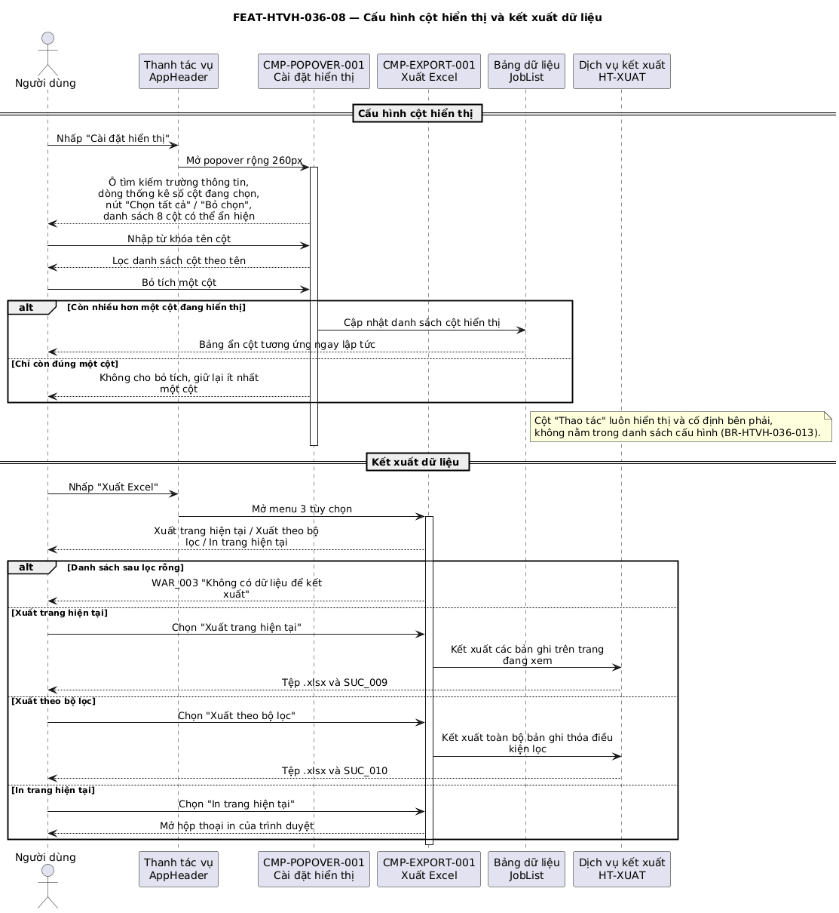

## Tính năng [FEAT-HTVH-036-08] Cấu hình cột hiển thị và kết xuất dữ liệu

### Mô tả yêu cầu

Cung cấp hai công cụ trên thanh tác vụ của màn hình danh sách. **Cài đặt hiển thị** mở một popover cho phép tìm kiếm theo tên cột, chọn tất cả, bỏ chọn và bật/tắt hiển thị từng cột trong 8 cột dữ liệu — kể cả cột STT. **Xuất Excel** mở một menu ba tùy chọn: xuất trang hiện tại, xuất theo bộ lọc đang áp dụng và in trang hiện tại.

Ràng buộc: cấu hình cột phải luôn giữ tối thiểu một cột đang hiển thị; nút *Bỏ chọn* giữ lại cột đầu tiên trong danh sách. Cột *Thao tác* không nằm trong danh sách cấu hình và luôn hiển thị.

### Luồng xử lý

`[[DIAGRAM: FUNC-HTVH-036_seq-08]]`



> *Hình: Trình tự — Cấu hình cột hiển thị và kết xuất dữ liệu.* Nguồn PlantUML: [FUNC-HTVH-036_seq-08.puml](diagrams/FUNC-HTVH-036_seq-08.puml) · bản vector: [FUNC-HTVH-036_seq-08.svg](diagrams/FUNC-HTVH-036_seq-08.svg)

**Luồng chính**

| Bước | Tác nhân | Hành động | Phản hồi của hệ thống |
|---|---|---|---|
| 1 | Người dùng | Nhấp **Cài đặt hiển thị** trên thanh tác vụ | Hệ thống mở popover rộng 260px gồm ô tìm kiếm, dòng thống kê số cột đang chọn, hai nút *Chọn tất cả* / *Bỏ chọn* và danh sách 8 ô đánh dấu. |
| 2 | Người dùng | Nhập từ khóa vào ô tìm kiếm | Hệ thống lọc danh sách cột theo tên, không phân biệt chữ hoa chữ thường. |
| 3 | Người dùng | Bỏ tích một cột | Hệ thống ẩn cột tương ứng khỏi bảng ngay lập tức. |
| 4 | Người dùng | Nhấp **Xuất Excel** trên thanh tác vụ | Hệ thống mở menu ba tùy chọn kết xuất. |
| 5 | Người dùng | Chọn **Xuất theo bộ lọc** | Hệ thống kết xuất toàn bộ bản ghi thỏa điều kiện lọc hiện hành thành tệp `.xlsx` và tải về máy. |

**Luồng thay thế**

| Mã luồng | Điều kiện rẽ nhánh | Xử lý | Quay về bước |
|---|---|---|---|
| ALT-07-01 | Người dùng nhấp **Chọn tất cả** | Bật hiển thị toàn bộ 8 cột | Bước 3 |
| ALT-07-02 | Người dùng nhấp **Bỏ chọn** | Ẩn tất cả trừ cột đầu tiên trong danh sách | Bước 3 |
| ALT-07-03 | Người dùng bỏ tích cột cuối cùng còn hiển thị | Không thực hiện thao tác, giữ nguyên cột đó (BR-HTVH-036-013) | Bước 3 |
| ALT-07-04 | Người dùng chọn **Xuất trang hiện tại** | Kết xuất các bản ghi đang hiển thị trên trang hiện tại thành tệp `.xlsx` | Bước 4 |
| ALT-07-05 | Người dùng chọn **In trang hiện tại** | Mở hộp thoại in của trình duyệt với nội dung trang hiện tại | Bước 4 |

**Luồng ngoại lệ**

| Mã luồng | Tình huống ngoại lệ | Xử lý của hệ thống | Mã thông báo |
|---|---|---|---|
| EXC-07-01 | Danh sách sau lọc không có bản ghi nào | Không sinh tệp, hiển thị thông báo không có dữ liệu để kết xuất | WAR_003 |
| EXC-07-02 | Lỗi khi sinh tệp kết xuất | Hiển thị thông báo lỗi, không tải tệp về | ERR_024 |

### Thiết kế giao diện

Ảnh mockup: `FEAT-HTVH-036-08_cai-dat-hien-thi.png`, `FEAT-HTVH-036-08_xuat-excel.png`

```
Popover Cài đặt hiển thị (rộng 260px)   Menu Xuất Excel
┌──────────────────────────────┐        ┌───────────────────────┐
│ Cài đặt hiển thị             │        │ 📄 Xuất trang hiện tại│
│ [🔍 Tìm kiếm trường thông tin]│        │ ▽  Xuất theo bộ lọc   │
│ Đã chọn 8/8   [Bỏ chọn][Tất cả]│      │ 🖨  In trang hiện tại  │
│ ☑ STT           ☑ Loại Job    │       └───────────────────────┘
│ ☑ Mã Job        ☑ ĐK kích hoạt│
│ ☑ Tên Job       ☑ Biểu thức Cron│
│ ☑ Mã dịch vụ    ☑ Trạng thái  │
└──────────────────────────────┘
```

### Mô tả các thành phần trên giao diện

| STT | Tên thành phần | Kiểu dữ liệu / Loại control | Bắt buộc / Giá trị mặc định | Giới hạn | Mô tả ràng buộc |
|---|---|---|---|---|---|
| 1 | Nút *Cài đặt hiển thị* | Nút mở popover | Bắt buộc | Đặt trên thanh tác vụ | Mở popover rộng 260px |
| 2 | Ô tìm kiếm tên cột | Ô nhập chữ, có nút xóa nhanh | Không / Rỗng | — | So khớp chuỗi con trên nhãn cột, không phân biệt hoa thường |
| 3 | Dòng thống kê số cột | Chữ | Bắt buộc | — | Hiển thị số cột đang chọn trên tổng số cột |
| 4 | Nút *Chọn tất cả* / *Bỏ chọn* | Liên kết dạng nút | Bắt buộc | — | *Bỏ chọn* giữ lại cột đầu tiên (BR-HTVH-036-013) |
| 5 | Danh sách ô đánh dấu cột | Ô đánh dấu | Bắt buộc / 8 cột đều bật | 8 mục | STT, Mã Job, Tên Job, Mã dịch vụ, Loại Job, Điều kiện kích hoạt, Biểu thức Cron, Trạng thái |
| 6 | Nút *Xuất Excel* | Nút mở menu | Bắt buộc | Đặt trên thanh tác vụ | Menu 3 mục, thả xuống từ mép phải |
| 7 | Mục *Xuất trang hiện tại* | Mục menu | Bắt buộc | — | Kết xuất bản ghi đang hiển thị trên trang hiện tại |
| 8 | Mục *Xuất theo bộ lọc* | Mục menu | Bắt buộc | — | Kết xuất toàn bộ bản ghi thỏa điều kiện lọc hiện hành |
| 9 | Mục *In trang hiện tại* | Mục menu | Bắt buộc | — | Mở hộp thoại in của trình duyệt |

### Xử lý sự kiện và thao tác

| STT | Sự kiện / Thao tác | Điều kiện | Xử lý của hệ thống | Kết quả / Mã thông báo |
|---|---|---|---|---|
| 1 | Nhấp *Cài đặt hiển thị* | Luôn khả dụng | Mở popover cấu hình cột | Popover hiển thị |
| 2 | Nhập từ khóa tên cột | Popover đang mở | Lọc danh sách cột theo tên | Danh sách cột thu hẹp |
| 3 | Tích / bỏ tích một cột | Còn nhiều hơn một cột đang hiện | Cập nhật danh sách cột hiển thị của bảng | Bảng ẩn/hiện cột ngay |
| 4 | Bỏ tích cột cuối cùng | Chỉ còn một cột đang hiện | Không thực hiện, giữ nguyên cột đó | Không có thay đổi |
| 5 | Nhấp *Chọn tất cả* | Popover đang mở | Bật hiển thị toàn bộ 8 cột | Bảng hiển thị đủ cột |
| 6 | Nhấp *Bỏ chọn* | Popover đang mở | Ẩn tất cả trừ cột đầu tiên | Bảng chỉ còn một cột dữ liệu và cột Thao tác |
| 7 | Chọn *Xuất trang hiện tại* | Có ít nhất một bản ghi | Sinh tệp `.xlsx` chứa bản ghi của trang hiện tại | SUC_009 |
| 8 | Chọn *Xuất theo bộ lọc* | Có ít nhất một bản ghi | Sinh tệp `.xlsx` chứa toàn bộ bản ghi thỏa điều kiện lọc | SUC_010 |
| 9 | Chọn *In trang hiện tại* | Luôn khả dụng | Mở hộp thoại in của trình duyệt | Hộp thoại in hiển thị |

### Thông báo

| STT | Mã thông báo | Loại | Nội dung | Điều kiện phát sinh |
|---|---|---|---|---|
| 1 | SUC_009 | SUC | Đã xuất file Excel cho trang hiện tại | Kết xuất trang hiện tại thành công |
| 2 | SUC_010 | SUC | Đã xuất file Excel theo bộ lọc đã chọn | Kết xuất theo bộ lọc thành công |
| 3 | WAR_003 | WAR | Không có dữ liệu để kết xuất | Danh sách sau lọc rỗng |
| 4 | ERR_024 | ERR | Không thể tạo tệp kết xuất, vui lòng thử lại sau | Lỗi khi sinh tệp |

### Tiêu chí chấp nhận

| STT | Tiêu chí — «Khi … thì hệ thống phải …» | Mã BR liên quan |
|---|---|---|
| 1 | Khi nhập "cron" vào ô tìm kiếm của popover, hệ thống phải chỉ hiển thị mục *Biểu thức Cron*. | Không áp dụng |
| 2 | Khi bỏ tích cột *Mã dịch vụ*, bảng phải ẩn cột đó ngay mà không cần tải lại trang. | BR-HTVH-036-013 |
| 3 | Khi chỉ còn một cột đang hiển thị, hệ thống phải không cho phép bỏ tích cột đó. | BR-HTVH-036-013 |
| 4 | Khi ẩn toàn bộ cột dữ liệu bằng nút *Bỏ chọn*, cột *Thao tác* vẫn phải hiển thị. | BR-HTVH-036-013 |
| 5 | Khi chọn *Xuất theo bộ lọc* trong lúc đang lọc theo Trạng thái "Hoạt động", tệp kết xuất phải chỉ chứa các Job có trạng thái đó. | Không áp dụng |

---
