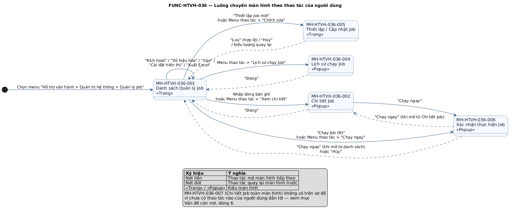
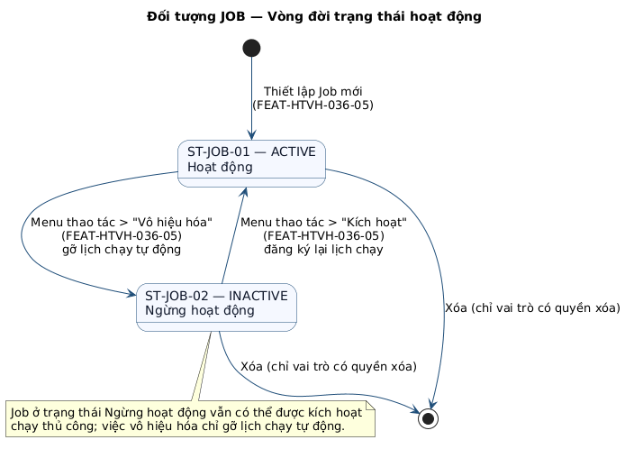
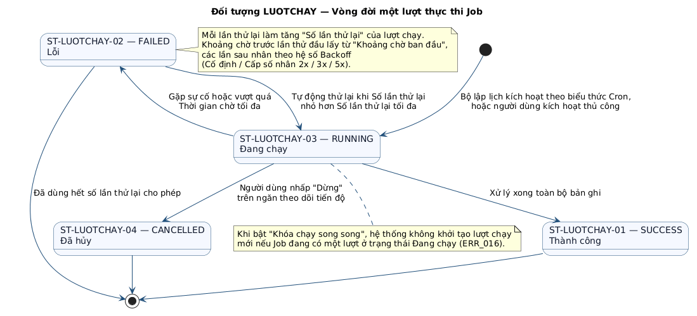
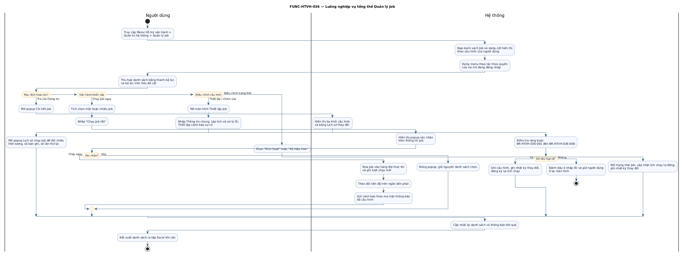

# Chức năng [FUNC-HTVH-036] Quản lý Job

<!--
  Đặc tả loại UI — soạn theo docs/CHILD_TEMPLATE_UI.md (đề cương v3.0).
  Nguồn đối chiếu: frontend/src/modules/ops-support/JobManagement/
                   frontend/app/ops-support/job-management/
                   frontend/src/context/RoleContext.tsx
  Sơ đồ PlantUML: docs/specifications/diagrams/FUNC-HTVH-036_*.puml
  Kết xuất lại ảnh sau khi sửa .puml:
      cd docs/specifications/diagrams && ./render.sh
      (hoặc PLANTUML_URL=http://10.16.17.7:8787 ./render.sh)
-->

> **Lưu ý về mã tham chiếu.** Bộ đăng ký (`messages.csv`, `roles.csv`, `states.csv`,
> `objects.csv`, `participants.csv`, `components.csv`) chưa được đưa vào kho mã này.
>
> **Đã chốt:** mã chức năng `FUNC-HTVH-036`, nhóm chức năng `GRP-HTVH-05`,
> chức năng kế tiếp `FUNC-HTVH-037`. Các mã nội bộ dẫn xuất từ mã chức năng —
> tính năng `FEAT-HTVH-036-xx`, màn hình `MH-HTVH-036-xxx`, quy tắc `BR-HTVH-036-xxx` —
> đã đồng bộ theo.
>
> **Còn là mã tạm**, đặt đúng dạng thức quy ước nhưng phải đối chiếu và cấp lại số
> khi hợp nhất vào sổ đăng ký: mã use case (`UC-08xx`), mã thông báo
> (`ERR_/SUC_/WAR_/INF_/CONF_`), mã vai trò (`ROLE-`), mã trạng thái (`ST-`),
> mã component (`CMP-`), mã tác nhân hệ thống (`HT-`).
> Xem mục Vấn đề còn mở, dòng 11 và 12.

---

## Mô tả chung

| Hạng mục | Nội dung |
|---|---|
| Loại chức năng | UI |
| Mã chức năng | FUNC-HTVH-036 |
| Tên chức năng | Quản lý Job |
| Nhóm chức năng | GRP-HTVH-05 — Quản trị hệ thống |
| Mô tả chức năng | Cho phép cán bộ quản trị và vận hành tra cứu, thiết lập, điều chỉnh và giám sát các tiến trình xử lý tự động (Job) của hệ thống CIC Core: khai báo thông tin định danh và tham số thực thi, lập lịch chạy bằng biểu thức Cron hoặc theo sự kiện, cấu hình chính sách thử lại khi gặp lỗi và ma trận cảnh báo sự cố, kích hoạt chạy thủ công ngoài lịch, theo dõi tiến độ theo thời gian thực và tra cứu lịch sử các lượt thực thi. |
| Tác nhân chính | ROLE-QTHT (Quản trị hệ thống), ROLE-QLVH (Quản lý vận hành) |
| Tác nhân phụ | ROLE-XEM (Người dùng chỉ xem), HT-SCH (Bộ lập lịch), HT-TB (Dịch vụ thông báo) |
| Vị trí chức năng | Menu: **Hỗ trợ vận hành > Quản trị hệ thống > Quản lý job**<br>Đường dẫn: `/ops-support/job-management` (khoá menu `ops-admin-jobs`) |
| Điều kiện tiên quyết | Người dùng đã đăng nhập, được cấp quyền truy cập phân hệ Hỗ trợ vận hành và có ít nhất quyền `view` trên đối tượng JOB. |
| Hậu điều kiện | Cấu hình Job được lưu và đồng bộ sang bộ lập lịch; mọi thao tác làm thay đổi dữ liệu sinh một bản ghi trong nhật ký thay đổi; mọi lượt kích hoạt chạy sinh một bản ghi lượt chạy. |
| Chức năng tiền đề | Không áp dụng |
| Chức năng kế tiếp | FUNC-HTVH-037 |
| Chức năng dùng chung | CMP-LAYOUT-001 (PageLayout), CMP-FILTER-001 (FilterBar / FilterCol), CMP-GRID-001 (Table + `tablePagination()`), CMP-ACTION-001 (ActionMenu), CMP-TAG-001 (StatusTag), CMP-POPOVER-001 (DisplaySettingPopover), CMP-EXPORT-001 (ExportExcelDropdown), CMP-HIST-001 (ChangeHistoryCollapse), CMP-HEADER-001 (`useHeaderActions`) |
| Yêu cầu đặc thù | Danh sách phản hồi dưới 1 giây với 500 bản ghi. Việc kích hoạt chạy Job là thao tác bất đồng bộ, không được khoá giao diện. Mọi biểu thức Cron hiển thị trên giao diện phải kèm diễn giải tiếng Việt. Ngăn theo dõi tiến độ cập nhật tối thiểu 1 lần/giây. Toàn bộ giá trị màu sắc, khoảng cách, kiểu chữ lấy từ `design-system/tokens.ts`, không khai báo giá trị cứng. |

---

## Truy vết yêu cầu

> Cột *Tên UC* do script build tự đổ từ `usecases.csv`. Các mã UC dưới đây là **mã dự kiến**,
> cần đối chiếu lại với BRD khi sổ đăng ký use case được đưa vào kho.

| Mã UC | Tên UC | Tính năng đáp ứng | Vai trò | Mức đáp ứng | Ghi chú |
|---|---|---|---|---|---|
| UC-0810 | Tra cứu danh sách tiến trình xử lý tự động | FEAT-HTVH-036-01 | Chính | Đầy đủ | Bộ lọc trên thanh, bộ lọc trên tiêu đề cột, diễn giải biểu thức Cron |
| UC-0811 | Kích hoạt chạy tiến trình xử lý thủ công | FEAT-HTVH-036-06 | Chính | Đầy đủ | Chạy đơn lẻ từ menu thao tác và chạy hàng loạt từ thanh tác vụ |
| UC-0812 | Xem chi tiết cấu hình tiến trình xử lý | FEAT-HTVH-036-02 | Chính | Đầy đủ | Ba khối cấu hình + bảng lịch sử thay đổi |
| UC-0813 | Tra cứu lịch sử thực thi tiến trình | FEAT-HTVH-036-07 | Chính | Một phần | Bộ lọc khoảng thời gian chưa gắn logic — xem Vấn đề còn mở, dòng 2 |
| UC-0814 | Thiết lập tham số và lịch chạy tiến trình | FEAT-HTVH-036-03, -04 | Chính | Đầy đủ | Ba khối cấu hình, hỗ trợ nhân bản từ Job có sẵn |
| UC-0815 | Điều chỉnh trạng thái hoạt động của tiến trình | FEAT-HTVH-036-05 | Chính | Một phần | Trạng thái ARCHIVED chưa có thao tác chuyển — xem Vấn đề còn mở, dòng 7 |
| Không thuộc UC | — | FEAT-HTVH-036-08 | Chính | Đầy đủ | Tính năng kỹ thuật dùng chung toàn hệ thống: cấu hình cột hiển thị và kết xuất dữ liệu. Căn cứ: quy ước giao diện chuẩn tại `docs/design-system/patterns.md` |

---

## Ma trận phân quyền

> Mã vai trò trong tài liệu ↔ hằng số trong mã nguồn (`RoleContext.tsx`):
> **ROLE-QTHT** ↔ `ADMIN` · **ROLE-QLVH** ↔ `MANAGER` · **ROLE-XEM** ↔ `VIEWER`.
> Vai trò hiện đang được nạp từ bộ nhớ cục bộ của trình duyệt (khoá `userRole`, mặc định `ADMIN`),
> phải chuyển sang lấy từ phiên đăng nhập thật khi tích hợp xác thực.

| STT | Mã tính năng | Tính năng / Thao tác | ROLE-QTHT | ROLE-QLVH | ROLE-XEM | Phạm vi dữ liệu |
|---|---|---|---|---|---|---|
| 1 | FEAT-HTVH-036-01 | Tra cứu và xem danh sách Job | X | X | X | Toàn hệ thống |
| 2 | FEAT-HTVH-036-06 | Kích hoạt chạy Job thủ công (đơn lẻ / hàng loạt) | X | X |  | Toàn hệ thống |
| 3 | FEAT-HTVH-036-06 | Dừng lượt chạy đang thực thi | X | X |  | Toàn hệ thống |
| 4 | FEAT-HTVH-036-02 | Xem chi tiết cấu hình và lịch sử thay đổi | X | X | X | Toàn hệ thống |
| 5 | FEAT-HTVH-036-07 | Tra cứu lịch sử chạy Job | X | X | X | Toàn hệ thống |
| 6 | FEAT-HTVH-036-03 | Thiết lập Job mới | X | X |  | Toàn hệ thống |
| 7 | FEAT-HTVH-036-04 | Chỉnh sửa cấu hình Job | X | X |  | Toàn hệ thống |
| 8 | FEAT-HTVH-036-03, -04 | Cấu hình ma trận cảnh báo sự cố | X | X |  | Toàn hệ thống |
| 9 | FEAT-HTVH-036-03, -04 | Cấu hình phụ thuộc giữa các Job | X |  |  | Toàn hệ thống |
| 10 | FEAT-HTVH-036-05 | Kích hoạt / Vô hiệu hóa Job | X | X |  | Toàn hệ thống |
| 11 | FEAT-HTVH-036-05 | Xóa Job | X |  |  | Toàn hệ thống |
| 12 | FEAT-HTVH-036-08 | Cấu hình cột hiển thị | X | X | X | Bản ghi được phép xem |
| 13 | FEAT-HTVH-036-08 | Kết xuất Excel và in danh sách | X | X | X | Bản ghi được phép xem |

**Quy tắc dựng giao diện theo quyền**

| Thành phần | Quy tắc |
|---|---|
| Ô chọn dòng (checkbox) | Bị vô hiệu hóa khi vai trò không có quyền `run` **và** không có quyền `delete` |
| Menu thao tác — *Chỉnh sửa*, *Kích hoạt*, *Vô hiệu hóa* | Chỉ hiện khi có quyền `edit` |
| Menu thao tác — *Chạy ngay* | Chỉ hiện khi có quyền `run` |
| Menu thao tác — *Xóa* (kèm đường phân cách phía trên) | Chỉ hiện khi có quyền `delete` |
| Menu thao tác — *Xem chi tiết*, *Lịch sử chạy Job* | Luôn hiện với mọi vai trò |

---

## Danh sách màn hình

| STT | Mã màn hình | Tên màn hình | Tính năng sử dụng | Mô tả |
|---|---|---|---|---|
| 1 | MH-HTVH-036-001 | Danh sách Quản lý Job | FEAT-HTVH-036-01, -02, -05, -06, -07, -08 | Trang chính tại `/ops-support/job-management`. Gồm thanh bộ lọc trong thẻ, bảng dữ liệu 8 cột cấu hình được + cột Thao tác cố định bên phải, và các nút trên thanh tác vụ. |
| 2 | MH-HTVH-036-002 | Popup Chi tiết Job | FEAT-HTVH-036-02 | Cửa sổ nổi rộng `70vw`, căn giữa. Gồm thanh trạng thái + nút *Chạy ngay*, ba khối cấu hình chỉ đọc và khối Lịch sử thay đổi. |
| 4 | MH-HTVH-036-004 | Popup Lịch sử chạy Job | FEAT-HTVH-036-07 | Cửa sổ nổi rộng `70vw`, căn giữa. Gồm thanh lọc theo trạng thái và khoảng thời gian, bảng 8 cột phân trang 10 bản ghi/trang. |
| 5 | MH-HTVH-036-005 | Thiết lập / Cập nhật Job | FEAT-HTVH-036-03, -04 | Trang biểu mẫu tại `/create` và `/{id}/edit`. Ba khối nhập liệu ngăn bằng đường kẻ, hai nút *Lưu* / *Hủy* căn giữa cuối trang. |
| 6 | MH-HTVH-036-006 | Popup Xác nhận thực hiện Job | FEAT-HTVH-036-06 | Cửa sổ xác nhận căn giữa, không icon tiêu đề, hai nút *Hủy* / *Chạy ngay* căn giữa ở chân. |

---

## Luồng màn hình

`[[DIAGRAM: FUNC-HTVH-036_nav-01]]`



> *Hình: Luồng chuyển màn hình theo thao tác của người dùng.* Nguồn PlantUML: [FUNC-HTVH-036_nav-01.puml](diagrams/FUNC-HTVH-036_nav-01.puml) · bản vector: [FUNC-HTVH-036_nav-01.svg](diagrams/FUNC-HTVH-036_nav-01.svg)

```
[MH-HTVH-036-001 Danh sách Quản lý Job]
   ├── Nhấp dòng bản ghi / Menu thao tác > "Xem chi tiết"
   │        └──> [MH-HTVH-036-002 Popup Chi tiết Job]
   │                 └── Nút "Chạy ngay"
   │                          └──> [MH-HTVH-036-006 Popup Xác nhận]
   │                                   └── "Chạy ngay"
   │                                            └──> Hiển thị thông báo thành công
   ├── Menu thao tác > "Lịch sử chạy Job"
   │        └──> [MH-HTVH-036-004 Popup Lịch sử chạy Job]
   ├── Menu thao tác > "Chạy ngay"  |  Thanh tác vụ > "Chạy Job (N)"
   │        └──> [MH-HTVH-036-006 Popup Xác nhận] ──> quay về danh sách
   └── Thanh tác vụ > "Thiết lập job mới"  |  Menu thao tác > "Chỉnh sửa"
            └──> [MH-HTVH-036-005 Thiết lập / Cập nhật Job]
                     └── "Lưu" thành công / "Hủy" / biểu tượng quay lại ──> quay về danh sách
```

---

## Sơ đồ trạng thái

**Đối tượng nghiệp vụ `JOB` — trạng thái hoạt động**

`[[DIAGRAM: FUNC-HTVH-036_state-01]]`



> *Hình: Vòng đời trạng thái hoạt động của đối tượng JOB.* Nguồn PlantUML: [FUNC-HTVH-036_state-01.puml](diagrams/FUNC-HTVH-036_state-01.puml) · bản vector: [FUNC-HTVH-036_state-01.svg](diagrams/FUNC-HTVH-036_state-01.svg)

| Mã trạng thái | Giá trị | Nhãn hiển thị | Ý nghĩa |
|---|---|---|---|
| ST-JOB-01 | `ACTIVE` | Hoạt động | Job đang được bộ lập lịch theo dõi và chạy tự động theo biểu thức Cron. |
| ST-JOB-02 | `INACTIVE` | Ngừng hoạt động | Job đã bị gỡ khỏi lịch tự động, vẫn có thể được kích hoạt chạy thủ công. |

**Đối tượng nghiệp vụ `LUOTCHAY` — trạng thái một lượt thực thi**

`[[DIAGRAM: FUNC-HTVH-036_state-02]]`



> *Hình: Vòng đời một lượt thực thi Job.* Nguồn PlantUML: [FUNC-HTVH-036_state-02.puml](diagrams/FUNC-HTVH-036_state-02.puml) · bản vector: [FUNC-HTVH-036_state-02.svg](diagrams/FUNC-HTVH-036_state-02.svg)

| Mã trạng thái | Giá trị | Nhãn hiển thị | Ý nghĩa |
|---|---|---|---|
| ST-LUOTCHAY-01 | `SUCCESS` | Thành công | Lượt chạy xử lý xong toàn bộ bản ghi. |
| ST-LUOTCHAY-02 | `FAILED` | Lỗi | Lượt chạy gặp sự cố hoặc vượt quá thời gian chờ tối đa. |
| ST-LUOTCHAY-03 | `RUNNING` | Đang chạy | Lượt chạy đang được thực thi. |
| ST-LUOTCHAY-04 | `CANCELLED` | Đã hủy | Lượt chạy bị người dùng dừng giữa chừng. |

---

## Luồng nghiệp vụ

`[[DIAGRAM: FUNC-HTVH-036_flow-01]]`



> *Hình: Luồng nghiệp vụ tổng thể Quản lý Job.* Nguồn PlantUML: [FUNC-HTVH-036_flow-01.puml](diagrams/FUNC-HTVH-036_flow-01.puml) · bản vector: [FUNC-HTVH-036_flow-01.svg](diagrams/FUNC-HTVH-036_flow-01.svg)

1. Cán bộ vận hành truy cập **Hỗ trợ vận hành > Quản trị hệ thống > Quản lý job**. Hệ thống nạp danh sách Job, dựng cột hiển thị theo cấu hình và dựng menu thao tác theo quyền của vai trò đang đăng nhập.
2. Cán bộ thu hẹp danh sách bằng thanh bộ lọc (Mã Job, Tên Job, Mã dịch vụ, Loại Job, Trạng thái) và bằng bộ lọc trực tiếp trên tiêu đề cột (Loại Job, Điều kiện kích hoạt, Trạng thái).
3. **Nhánh tra cứu:** mở popup Chi tiết Job để xem ba khối cấu hình và bảng Lịch sử thay đổi; mở popup Lịch sử chạy Job để đối chiếu thời lượng, số bản ghi đã xử lý và số lần thử lại của từng lượt.
4. **Nhánh vận hành khẩn cấp:** tích chọn một hoặc nhiều Job rồi nhấp *Chạy Job (N)*, hoặc chọn *Chạy ngay* trên menu thao tác của một dòng. Hệ thống bật popup xác nhận có hiển thị Mã Job và Tên Job; sau khi xác nhận, Job được đưa vào hàng đợi thực thi, một bản ghi lượt chạy mới được sinh ra và cảnh báo được gửi theo ma trận thông báo đã cấu hình.
5. **Nhánh điều chỉnh cấu hình:** mở màn hình Thiết lập Job, nhập ba khối thông tin, hệ thống kiểm tra ràng buộc rồi ghi cấu hình, ghi nhật ký thay đổi và đăng ký lại lịch chạy với bộ lập lịch.
6. **Nhánh điều chỉnh trạng thái:** chọn *Kích hoạt* hoặc *Vô hiệu hóa* để bật/tắt lịch chạy tự động của Job.
7. Khi cần báo cáo, cán bộ kết xuất danh sách ra tệp Excel theo trang hiện tại hoặc theo bộ lọc đang áp dụng.

---

## Quy tắc nghiệp vụ

| Mã quy tắc | Nội dung quy tắc | Áp dụng cho | Mã thông báo khi vi phạm |
|---|---|---|---|
| BR-HTVH-036-001 | Mã Job là bắt buộc, tối đa 20 ký tự, chỉ gồm chữ in hoa `A–Z`, chữ số `0–9`, dấu gạch ngang `-` và dấu gạch dưới `_`. Ký tự nhập vào được tự động chuyển sang chữ in hoa và loại bỏ ký tự không hợp lệ ngay khi gõ. | FEAT-HTVH-036-03 | ERR_001, ERR_002 |
| BR-HTVH-036-002 | Mã Job là bất biến: ở chế độ cập nhật, ô nhập Mã Job bị khóa và không cho phép chỉnh sửa. | FEAT-HTVH-036-04 | Không áp dụng |
| BR-HTVH-036-003 | Tên Job là bắt buộc, tối đa 100 ký tự. Mã dịch vụ là bắt buộc, tối đa 50 ký tự. Loại Job là bắt buộc, chọn từ 8 giá trị đã định nghĩa. | FEAT-HTVH-036-03, -04 | ERR_003, ERR_004, ERR_005, ERR_006 |
| BR-HTVH-036-004 | Mô tả Job tối đa 1000 ký tự. Tham số bổ sung (YAML/JSON) tối đa 1500 ký tự. Cả hai ô đều hiển thị bộ đếm ký tự. | FEAT-HTVH-036-03, -04 | ERR_007, ERR_008 |
| BR-HTVH-036-005 | Khi Điều kiện kích hoạt là `SCHEDULER` hoặc `MANUAL`, ô **Biểu thức Cron** hiển thị và là bắt buộc. Khi Điều kiện kích hoạt là `EVENT`, ô Biểu thức Cron bị ẩn và thay bằng ô **Tên sự kiện kích hoạt** là bắt buộc. | FEAT-HTVH-036-03, -04 | ERR_011, ERR_012 |
| BR-HTVH-036-006 | Chờ tối đa (giây) là bắt buộc, giá trị nguyên trong khoảng 1 đến 86400 giây. | FEAT-HTVH-036-03, -04 | ERR_009, ERR_010 |
| BR-HTVH-036-007 | Số lần thử lại tối đa là giá trị nguyên trong khoảng 0 đến 10 lần. | FEAT-HTVH-036-03, -04 | ERR_013 |
| BR-HTVH-036-008 | Chờ ban đầu (giây) là giá trị nguyên trong khoảng 1 đến 86400 giây. | FEAT-HTVH-036-03, -04 | ERR_010 |
| BR-HTVH-036-009 | Khi bật "Khóa chạy song song", hệ thống không khởi tạo lượt chạy mới nếu Job đang có một lượt ở trạng thái `RUNNING`. | FEAT-HTVH-036-06 | ERR_016 |
| BR-HTVH-036-010 | Mọi thao tác kích hoạt chạy Job — đơn lẻ hay hàng loạt, từ danh sách hay từ popup chi tiết — đều phải qua popup xác nhận. Popup không có icon tiêu đề, hai nút được căn giữa ở chân. | FEAT-HTVH-036-06 | CONF_001, CONF_002 |
| BR-HTVH-036-011 | Nút *Chạy Job (N)* chỉ xuất hiện trên thanh tác vụ khi số dòng được chọn lớn hơn 0, và biến mất ngay khi bỏ chọn hết. Sau khi kích hoạt thành công, danh sách chọn được xóa trắng. | FEAT-HTVH-036-06 | Không áp dụng |
| BR-HTVH-036-012 | Ô chọn dòng chỉ khả dụng với vai trò có quyền `run` hoặc `delete`. Các mục trên menu thao tác được dựng theo quyền — xem bảng quy tắc ở mục Ma trận phân quyền. | FEAT-HTVH-036-01, -05, -06 | Không áp dụng |
| BR-HTVH-036-013 | Cấu hình cột hiển thị phải luôn giữ tối thiểu một cột. Nút *Bỏ chọn* giữ lại cột đầu tiên. Cột *Thao tác* không nằm trong danh sách cấu hình và luôn hiển thị, cố định bên phải. | FEAT-HTVH-036-08 | Không áp dụng |
| BR-HTVH-036-014 | Mọi vị trí hiển thị biểu thức Cron phải kèm diễn giải tiếng Việt. Biểu thức có ít hơn 5 trường được diễn giải là "Biểu thức Cron không đúng định dạng"; biểu thức rỗng được diễn giải là "Chưa thiết lập biểu thức Cron". | FEAT-HTVH-036-01, -02, -03, -04 | Không áp dụng |
| BR-HTVH-036-015 | Mọi thao tác làm thay đổi dữ liệu cấu hình Job phải sinh một bản ghi trong Bảng Lịch sử thay đổi với đủ 8 cột chuẩn. Bảng đặt trong khối thu gọn, mặc định đóng, hiển thị tối đa 20 bản ghi mới nhất xếp trên cùng, vùng cuộn cao 250px, không phân trang. | FEAT-HTVH-036-06, -03, -04, -05 | Không áp dụng |
| BR-HTVH-036-016 | Khi nhân bản Job từ bản ghi có sẵn, hệ thống điền sẵn Mã Job là `{mã gốc}_COPY` và Tên Job là `{tên gốc} (Bản sao)`; các tham số còn lại sao chép nguyên vẹn. | FEAT-HTVH-036-03 | Không áp dụng |
| BR-HTVH-036-017 | Trạng thái Job chuyển đổi hai chiều giữa `ACTIVE` và `INACTIVE`. Chuyển sang `INACTIVE` thì gỡ lịch chạy tự động; chuyển sang `ACTIVE` thì đăng ký lại lịch theo biểu thức Cron hiện hành. | FEAT-HTVH-036-05 | Không áp dụng |
| BR-HTVH-036-018 | Số lần thử lại của một lượt chạy hiển thị dưới dạng số nguyên thuần túy, căn giữa, không dùng thẻ màu hay nhãn. | FEAT-HTVH-036-07 | Không áp dụng |
| BR-HTVH-036-019 | Thanh tác vụ chỉ có **một** nút mang kiểu nút chính tại mỗi thời điểm. Khi chưa chọn dòng nào, nút chính là *Thiết lập job mới*. Khi đã chọn ít nhất một dòng, nút *Chạy Job (N)* giành vị trí nút chính và *Thiết lập job mới* lùi về kiểu nút thường. Trên màn hình nhỏ, các nút phụ dạng nhãn chữ bị ẩn, chỉ giữ nút chính dạng biểu tượng tròn và các nút dạng thành phần tự dựng (*Cài đặt hiển thị*, *Xuất Excel*). | FEAT-HTVH-036-02, -04, -06, -08 | Không áp dụng |
| BR-HTVH-036-020 | **Logic rẽ nhánh (Trigger Override):** Khi một Job được khai báo có ít nhất 1 Job xử lý trước, hệ thống tự động khóa ô "Điều kiện kích hoạt" trên khối Thông tin chung về trạng thái **Theo sự kiện (EVENT)**. Mọi biểu thức Cron sẽ bị vô hiệu hóa. | FEAT-HTVH-036-03, -04 | Không áp dụng (Tự động khóa UI) |
| BR-HTVH-036-021 | **Điều kiện hội tụ (Join Condition):** Nếu Job hiện tại phụ thuộc N Job xử lý trước với điều kiện "Khi thành công", Job chỉ kích hoạt khi TOÀN BỘ N Job xử lý trước đều đã hoàn thành và đạt trạng thái SUCCESS. | Lõi hệ thống | Không áp dụng |
| BR-HTVH-036-022 | **Chống vòng lặp phụ thuộc:** Khi nhấp "Lưu", hệ thống quét cây phụ thuộc. Nếu phát hiện Job tạo ra vòng lặp (VD: A -> B -> C -> A), hệ thống chặn lại và không cho phép lưu. | FEAT-HTVH-036-03, -04 | ERR_023 |
| BR-HTVH-036-023 | **Xóa Job có ràng buộc:** Không cho phép xóa (Thao tác Xóa Job) hoặc Vô hiệu hóa (INACTIVE) một Job nếu nó đang đóng vai trò là Job xử lý trước của một Job ACTIVE khác. | FEAT-HTVH-036-05 | ERR_024 |
| BR-HTVH-036-024 | **SLA Breach Alert:** Hệ thống theo dõi thời lượng thực thi của Job. Nếu vượt quá Thời gian SLA dự kiến (giây), kích hoạt sự kiện cảnh báo "Khi chạy chậm quá SLA" tới các kênh đã cấu hình. | Lõi hệ thống | Không áp dụng |
| BR-HTVH-036-025 | **Dọn dẹp dữ liệu (Retention):** Job tự động dọn dẹp (xóa cứng) lịch sử lượt chạy theo số ngày cấu hình ở mục "Lưu log thành công" và "Lưu log lỗi". Giá trị 0 nghĩa là không lưu. | Lõi hệ thống | Không áp dụng |

---

## Dữ liệu và tích hợp

| STT | Loại | Tên đối tượng | Chiều | Mô tả / Ghi chú |
|---|---|---|---|---|
| 1 | Bảng CSDL | `JOB_DEFINITION` | Đọc / Ghi | Cấu hình Job: mã, tên, loại, mã dịch vụ, mô tả, tham số bổ sung, điều kiện kích hoạt, biểu thức Cron, thời gian chờ, chính sách xử lý khi bỏ lỡ, khóa chạy song song, chính sách thử lại, trạng thái hoạt động, SLA dự kiến, Lưu log thành công, Lưu log lỗi |
| 2 | Bảng CSDL | `JOB_NOTIFICATION_MATRIX` | Đọc / Ghi | Ma trận cảnh báo: 5 sự kiện × 3 kênh (SMS / Push / Email) và danh sách người nhận riêng cho từng sự kiện |
| 3 | Bảng CSDL | `JOB_EXECUTION_LOG` | Đọc / Ghi | Nhật ký lượt chạy: mã lượt chạy, thời gian bắt đầu / kết thúc, thời lượng, số lần thử lại, người kích hoạt, điều kiện kích hoạt, số bản ghi xử lý / lỗi, trạng thái, thông điệp lỗi, Node thực thi, Tham số động (JSON) |
| 4 | Bảng CSDL | `JOB_RUN_LOG_DETAIL` | Đọc / Ghi | Các dòng nhật ký chi tiết của lượt chạy: dấu thời gian, mức nhật ký, tên bước, nội dung |
| 5 | Bảng CSDL | `JOB_AUDIT_HISTORY` | Đọc / Ghi | Nhật ký thay đổi cấu hình theo 8 cột chuẩn, phục vụ Bảng Lịch sử thay đổi |
| 6 | Bảng CSDL | `JOB_DEPENDENCY` | Đọc / Ghi | Quan hệ phụ thuộc giữa các Job (phụ thuộc cứng / mềm, điều kiện kích hoạt tiếp theo) |
| 7 | Bảng CSDL | `SYS_USER` | Đọc | Danh mục người dùng hệ thống, phục vụ ô chọn người nhận cảnh báo riêng |
| 8 | API | `GET /api/v1/jobs` | Ra | Lấy danh sách Job kèm điều kiện lọc và phân trang |
| 9 | API | `GET /api/v1/jobs/{id}` | Ra | Lấy cấu hình chi tiết của một Job |
| 10 | API | `POST /api/v1/jobs` | Ra | Tạo Job mới |
| 11 | API | `PUT /api/v1/jobs/{id}` | Ra | Cập nhật cấu hình Job |
| 12 | API | `PATCH /api/v1/jobs/{id}/status` | Ra | Đổi trạng thái hoạt động của Job |
| 13 | API | `DELETE /api/v1/jobs/{id}` | Ra | Xóa Job |
| 14 | API | `POST /api/v1/jobs/{id}/execute` | Ra | Kích hoạt Job chạy ngay ngoài lịch |
| 15 | API | `POST /api/v1/job-runs/{runId}/stop` | Ra | Dừng một lượt chạy đang thực thi |
| 16 | API | `GET /api/v1/jobs/{id}/runs` | Ra | Lấy danh sách lượt chạy của một Job |
| 17 | API | `GET /api/v1/jobs/{id}/audit-history` | Ra | Lấy nhật ký thay đổi cấu hình của một Job |
| 18 | Hàng đợi | Hàng đợi thực thi Job (HT-SCH) | Ra | Đưa yêu cầu chạy Job vào hàng đợi của bộ lập lịch |
| 19 | API | Dịch vụ thông báo (HT-TB) | Ra | Gửi cảnh báo qua SMS / Push / Email theo ma trận đã cấu hình |
| 20 | File | Tệp `.xlsx` kết xuất danh sách Job | Ra | Sinh tại phía người dùng hoặc phía máy chủ tùy khối lượng dữ liệu |
| 21 | File | Tệp `{mã Job}-progress.log` | Ra | Kết xuất nhật ký thời gian thực từ ngăn theo dõi tiến độ |

---

## Phân loại dữ liệu

| STT | Trường / Nhóm dữ liệu | Phân loại | Quy tắc che | Ghi nhật ký | Thời hạn lưu |
|---|---|---|---|---|---|
| 1 | Mã Job, Tên Job, Loại Job, Mã dịch vụ | Nội bộ | Hiển thị đầy đủ | Ghi khi tạo mới và khi sửa | Theo vòng đời của Job |
| 2 | Mô tả Job, cấu hình lập lịch và chính sách thử lại | Nội bộ | Hiển thị đầy đủ | Ghi khi sửa | Theo vòng đời của Job |
| 3 | Tham số bổ sung (YAML/JSON) | Nhạy cảm | Che các khóa có tên chứa `password`, `secret`, `token`, `key` bằng `******`; chỉ ROLE-QTHT xem được bản đầy đủ | Ghi khi sửa, không ghi nội dung giá trị bị che | Theo vòng đời của Job |
| 4 | Chuỗi kết nối, mật khẩu, mã thông báo truy cập | Nhạy cảm | Che 100% trên mọi màn hình | Ghi thao tác truy cập, không ghi giá trị | Theo vòng đời của Job |
| 5 | Email nhận cảnh báo và danh sách người nhận riêng | Định danh cá nhân | Hiển thị đầy đủ với ROLE-QTHT và ROLE-QLVH; che phần trước ký tự `@` với ROLE-XEM | Ghi khi sửa | Theo vòng đời của Job |
| 6 | Tên đăng nhập và họ tên người cập nhật trong nhật ký thay đổi | Định danh cá nhân | Hiển thị tên đăng nhập; họ tên đầy đủ chỉ hiện qua tooltip | Ghi | 5 năm |
| 7 | Địa chỉ IP thiết bị thực hiện thao tác | Định danh cá nhân | Hiển thị đầy đủ với ROLE-QTHT và ROLE-QLVH | Ghi | 5 năm |
| 8 | Nhật ký lượt chạy (thời gian, thời lượng, số bản ghi, trạng thái) | Nội bộ | Hiển thị đầy đủ | Ghi | 2 năm |
| 9 | Nội dung nhật ký chi tiết của lượt chạy | Nhạy cảm | Không được ghi dữ liệu định danh khách hàng vào nhật ký; nếu có thì phải che trước khi lưu | Ghi | 90 ngày |
| 10 | Tệp kết xuất Excel danh sách Job | Nội bộ | Theo phạm vi dữ liệu của vai trò kết xuất | Ghi thao tác kết xuất kèm tên tài khoản và thời điểm | Không lưu phía máy chủ |

---

## Vấn đề còn mở

> Mục này phải rỗng thì chức năng mới được chuyển sang trạng thái đã phê duyệt.
> Các dòng dưới đây là chênh lệch giữa mã nguồn hiện tại và đặc tả này, hoặc điểm cần người quyết định.

| STT | Nội dung vấn đề | Người quyết định | Hạn chốt | Trạng thái |
|---|---|---|---|---|
| 1 | **Bộ lọc trên thanh không tác động tới bảng dữ liệu.** `JobFilter.tsx` gọi `useJobManagement()` tạo một bản trạng thái riêng, độc lập với bản mà `index.tsx` dùng để cấp dữ liệu cho bảng. Cần nâng trạng thái lọc lên trang cha hoặc bọc bằng context dùng chung. | Trưởng nhóm phát triển |  | Mở |
| 2 | **Ô lọc khoảng thời gian trên popup Lịch sử chạy chưa gắn logic.** Bộ chọn ngày đã hiển thị nhưng giá trị chọn không tham gia lọc dữ liệu. | Trưởng nhóm phát triển |  | Mở |
| 3 | **Popup Lịch sử chạy hiển thị dữ liệu của Job khác khi Job hiện tại chưa có lượt chạy.** Mã nguồn dự phòng bằng cách trả về toàn bộ danh sách mẫu — phải đổi thành trạng thái rỗng. | Trưởng nhóm phát triển |  | Mở |
| 4 | **Nhãn "Cho phép chạy song song" mang ngữ nghĩa ngược với giá trị.** Giá trị `true` hiển thị nhãn "Khóa chạy song song". Cần thống nhất: đổi tên trường thành "Khóa chạy song song", hoặc đảo giá trị. | Chủ nhiệm nghiệp vụ |  | Mở |
| 5 | **Đơn vị Thời gian chờ tối đa không nhất quán.** Dữ liệu mẫu lưu mili giây (`3600000`) trong khi biểu mẫu và popup chi tiết diễn giải là giây (1–86400). Phải chốt một đơn vị lưu trữ duy nhất. | Chủ nhiệm nghiệp vụ |  | Mở |
| 6 | **Trạng thái `ARCHIVED` (ST-JOB-03) chưa có thao tác chuyển trên giao diện.** Cần bổ sung thao tác đưa vào lưu trữ, hoặc gỡ trạng thái này khỏi mô hình dữ liệu. | Chủ nhiệm nghiệp vụ |  | Mở |
| 7 | **Thao tác xóa Job mới dừng ở thông báo, chưa loại bản ghi khỏi danh sách.** Cần hiện thực đầy đủ kèm popup xác nhận và kiểm tra ràng buộc phụ thuộc (ERR_023). | Trưởng nhóm phát triển |  | Mở |
| 8 | **Nút *Tìm kiếm* trên thanh bộ lọc không gắn hành vi.** Danh sách hiện lọc tức thời theo từng ký tự; cần chốt: bỏ nút này, hay chuyển sang cơ chế lọc theo lệnh tìm kiếm. | Chủ nhiệm nghiệp vụ |  | Mở |
| 9 | **Danh mục Loại Job lệch giữa hai nơi.** Ô lọc trên thanh có 8 tùy chọn, bộ lọc tiêu đề cột chỉ có 5 (thiếu `SPRING_BEAN`, `REST_API`, `SQL_SCRIPT`). Cần thống nhất về một danh mục dùng chung. | Chủ nhiệm nghiệp vụ |  | Mở |
| 10 | **Mã thông báo, mã vai trò, mã trạng thái trong tài liệu này là mã tạm.** Phải đối chiếu `messages.csv`, `roles.csv`, `states.csv`, `groups.csv`, `participants.csv`, `components.csv` và cấp lại số trong cùng yêu cầu hợp nhất. | Ban chuẩn hóa tài liệu |  | Mở |
| 11 | **Mã UC trong mục Truy vết yêu cầu là mã dự kiến.** Cần đối chiếu BRD và `usecases.csv` để xác nhận hoặc thay bằng mã thật. | Ban chuẩn hóa tài liệu |  | Mở |
| 12 | **Vai trò đang lấy từ bộ nhớ cục bộ của trình duyệt**, mặc định là `ADMIN`. Phải chuyển sang lấy từ phiên đăng nhập thật khi tích hợp mô-đun xác thực; trước đó không được đưa lên môi trường thật. | Trưởng nhóm phát triển |  | Mở |
| 13 | **Thẻ *Bước hiện tại* trên ngăn theo dõi tiến độ không bao giờ đổi giá trị** — khởi tạo bằng chuỗi tiếng Trung `初始化` và hàm cập nhật không được gọi ở bất kỳ đâu, nên thẻ luôn hiển thị đúng chuỗi đó suốt lượt chạy. Phải đổi sang tiếng Việt và lấy giá trị từ dữ liệu lượt chạy thay vì hằng số. | Trưởng nhóm phát triển |  | Mở |
| 14 | **Toàn bộ dữ liệu hiện là dữ liệu mẫu tĩnh** trong `mockData.ts`. Danh sách API tại mục Dữ liệu và tích hợp là đề xuất, cần chốt hợp đồng giao diện với nhóm phát triển phía máy chủ. | Kiến trúc sư hệ thống |  | Mở |
| 15 | **`modals/JobRunModal.tsx` là thành phần chết** — không tệp nào nhập nó, không có lối vào từ giao diện. Cần xoá khỏi mã nguồn để không gây nhầm khi đối chiếu đặc tả. | Trưởng nhóm phát triển |  | Mở |
| 16 | **Thanh thao tác hàng loạt trong `JobList.tsx` là mã chết** — hai hàm `handleBulkRun` và `handleBulkDelete` được định nghĩa nhưng không nút nào gọi tới; kéo theo hai thuộc tính `onBulkRun` / `onBulkDelete` truyền từ trang cha, biến trạng thái `isDeleting` và các thành phần nhập thừa (`Button`, `Space`, `Popconfirm`, `CopyOutlined`) đều không dùng. Cần chốt: bổ sung thanh thao tác hàng loạt vào thiết kế, hay xoá hẳn mã thừa. | Chủ nhiệm nghiệp vụ |  | Mở |
| 17 | **Nút *Chạy ngay* trên popup Chi tiết Job không thực sự kích hoạt Job** — chỉ mở ngăn theo dõi tiến độ và hiện thông báo, không gọi hàm chạy Job nên không sinh bản ghi lượt chạy. Hành vi đặc tả tại FEAT-HTVH-036-06 là hành vi đích, chưa khớp mã nguồn. | Trưởng nhóm phát triển |  | Mở |
| 18 | **Ngăn theo dõi tiến độ (MH-HTVH-036-003) hiện là mô phỏng hoàn toàn** — tiến độ, thời lượng, số bản ghi và dòng nhật ký đều sinh bằng số ngẫu nhiên theo chu kỳ 800ms, không đọc dữ liệu thật; nút *Dừng* chỉ hiện thông báo chứ không dừng lượt chạy nào. Ngoài ra thành phần dùng mã màu cứng, vi phạm quy tắc bắt buộc dùng design token. Cần chốt: giữ trong phạm vi và hiện thực thật, hay gỡ khỏi thiết kế. | Chủ nhiệm nghiệp vụ |  | Mở |

---

## Lịch sử thay đổi

> Script build tự đổ nội dung từ Git log của chính file này. Không gõ tay.

| Phiên bản | Ngày | Người thực hiện | Mô tả thay đổi |
|---|---|---|---|
| 2.0.0 | 07/08/2026 | — | Soạn lại toàn bộ theo mẫu UI v3.0 trên cơ sở đọc mã nguồn thực tế: tách thành 7 tính năng, bổ sung 7 màn hình, 18 quy tắc nghiệp vụ, 11 sơ đồ PlantUML và 15 vấn đề còn mở |
| 1.0.0 | 06/08/2026 | — | Bản đặc tả đầu tiên |
